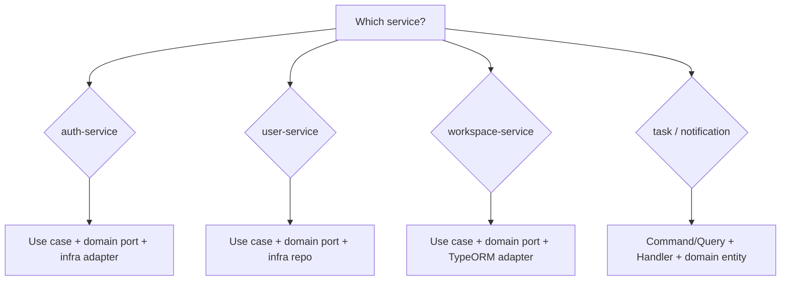

# CollabSpace Service Architecture Guide

This document tells AI agents **how each service is organized** and **where new code belongs**. CollabSpace is not a uniform monolith: each service uses a different layering style on purpose. **Always match the service you are editing**—do not copy patterns from another service unless the task explicitly crosses boundaries.

Read this before adding features, refactoring folders, or introducing new abstractions.

Related docs:

- `.claude/docs/coding-conventions.md` — DTO, errors, tests, events
- `.claude/docs/service-contracts.md` — HTTP/gRPC/event contracts
- `docs/design-patterns.md` — design pattern catalog (Vietnamese, file references)
- `services/<name>/CLAUDE.md` — short service-local cheat sheet

---

## Golden rules (all services)

1. **Service boundary** — One database per service. No shared tables. Cross-service identity key is `userId`.
2. **Read neighbors first** — Open a similar file in the same folder before inventing structure.
3. **Thin transport** — Controllers parse HTTP/gRPC/events and delegate; business rules live deeper.
4. **Stable errors** — Prefer `{ code, message }` on Nest exceptions (match existing codes in that service).
5. **Events** — Include `eventId` + `occurredAt`; consumers must be idempotent (see `resilience.md`).
6. **Health** — Expose `/health`, `/health/live`, `/health/ready` with dependency checks where implemented.
7. **Docs** — Update `service-contracts.md` when routes, proto, or event payloads change.

---

## Quick comparison

| Service              | Pattern                     | DB                 | Global prefix | API base                | Port     |
| -------------------- | --------------------------- | ------------------ | ------------- | ----------------------- | -------- |
| auth-service         | Clean / hexagonal           | Postgres / TypeORM | `api/v1`      | `/api/v1/auth`          | 3000     |
| user-service         | Clean / hexagonal           | Postgres / TypeORM | `api/v1`      | `/api/v1/users`         | 3000     |
| workspace-service    | Clean Architecture          | Postgres / TypeORM | `api/v1`      | `/api/v1/workspaces`    | **8080** |
| task-service         | Clean + CQRS                | Mongo / Mongoose   | `api/v1`      | `/api/v1/tasks`         | 3000     |
| notification-service | Clean + CQRS (event-driven) | Mongo / Mongoose   | `api/v1`      | `/api/v1/notifications` | 3000     |

**All five services** use `app.setGlobalPrefix('api/v1')`. Controllers use the resource name directly (e.g. `@Controller('tasks')`, `@Controller('notifications')`) — no `v1/` prefix in controller decorators.

---

## auth-service

**Path:** `services/auth-service`  
**Stack:** NestJS 11, TypeORM, PostgreSQL, Redis, gRPC, Graphile Worker outbox  
**Local context:** `services/auth-service/CLAUDE.md`

### Pattern: clean / hexagonal

Dependency direction (aligned with user-service):

```text
presentation → application/use-cases → domain (entities, ports) → infrastructure + integrations
```

- Controllers inject use cases directly — no `AppService` facade.
- `USER_REPOSITORY` / `REFRESH_TOKEN_REPOSITORY` + outbound ports (`OTP_STORE`, `EMAIL_OUTBOX`, `USER_PROFILE_CLIENT`).
- TypeORM entities live under `infrastructure/identity/` and `infrastructure/refresh-tokens/`.

### Folder map

```text
src/
├── presentation/http/auth.controller.ts
├── presentation/grpc/auth.grpc.controller.ts
├── application/use-cases/ | application/services/ | application/dto/
├── domain/entities/ | domain/types/ | domain/repositories/ | domain/ports/
├── infrastructure/
│   ├── repositories/
│   ├── database/entities/     # *.orm-entity.ts (UserOrmEntity, …)
│   ├── identity/              # TypeORM feature module for users/roles
│   ├── refresh-tokens/
│   ├── redis/
│   ├── outbox/
│   ├── emails/
│   └── graphile-worker/
├── integrations/user-profiles/
├── common/http/               # middleware only (no business types)
├── configuration/
├── health/
└── generated/proto/
```

### Where to add code

| Task                           | Location                                                         |
| ------------------------------ | ---------------------------------------------------------------- |
| New HTTP route                 | `presentation/http/auth.controller.ts`                           |
| New auth action                | `application/use-cases/<action>.use-case.ts`                     |
| HTTP request DTO               | `application/dto/auth-request.dto.ts`                            |
| Use-case result type           | `application/dto/auth-use-case-results.ts`                       |
| Shared JWT/session/OTP         | `application/services/`                                          |
| Domain auth user / login rules | `domain/entities/auth-user.ts`, `domain/entities/user.entity.ts` |
| User/role/password DB          | `infrastructure/repositories/typeorm-user.repository.ts`         |
| TypeORM entity                 | `infrastructure/database/entities/*.orm-entity.ts`               |

### Conventions

- Path alias `@/*` → `src/*`
- Avoid scattered `process.env`; use `ConfigurationService`
- HTTP request DTOs in `application/dto/auth-request.dto.ts` (class-validator + Swagger)
- Passwords: scrypt; JWT: `jose` HS256; OTP hashed before Redis
- Register saga: rollback new auth user if user-service gRPC fails after insert

### Do not

- Put business logic only in controllers
- Send email synchronously from HTTP handlers when outbox exists
- Log passwords, OTPs, or tokens

---

## user-service

**Path:** `services/user-service`  
**Stack:** NestJS 11, TypeORM, PostgreSQL, gRPC server + auth gRPC client, Azure Blob (avatars)  
**Local context:** `services/user-service/CLAUDE.md`

### Pattern: clean / hexagonal

Strict dependency direction:

```text
presentation → application → domain (ports) → infrastructure
```

### Folder map

```text
src/
├── application/
│   ├── use-cases/*.use-case.ts    # One class per action, execute()
│   └── dto/                       # Response DTOs + toXxxResponseDto() mappers
├── domain/
│   ├── entities/                  # Plain domain classes (no ORM decorators)
│   └── repositories/              # Interface + Symbol token
├── infrastructure/
│   ├── database/entities/*.orm-entity.ts
│   ├── repositories/              # TypeORM + in-memory implementations
│   ├── services/azure-blob.service.ts  # Avatar upload (mock when unconfigured)
│   └── outbox/                    # UserOutboxService (CDC → Kafka)
├── integrations/auth/
└── presentation/
    ├── http/
    └── grpc/
```

### Where to add code

| Task                | Location                                           |
| ------------------- | -------------------------------------------------- |
| HTTP endpoint       | `presentation/http/*.controller.ts`                |
| Request DTO         | `presentation/http/dto/`                           |
| Use case            | `application/use-cases/<name>.use-case.ts`         |
| Response shape      | `application/dto/` + mapper function               |
| Domain model        | `domain/entities/`                                 |
| Repository contract | `domain/repositories/` + inject token              |
| TypeORM entity      | `infrastructure/database/entities/*.orm-entity.ts` |
| Repository impl     | `infrastructure/repositories/`                     |
| External client     | `integrations/`                                    |
| Outbox event        | `infrastructure/outbox/`                           |

Register use cases in `app.module.ts`. Repository binding uses factory: TypeORM when `DATABASE_URL` is set, else in-memory.

### Conventions

- Use cases: `@Injectable()`, `execute(...)`, inject `@Inject(USER_PROFILE_REPOSITORY)`
- Never return ORM entities from controllers
- Protected HTTP routes use `AuthGuard` + auth gRPC `VerifyAccessTokenLite`
- `me` routes resolve `userId` from `request.user.id`, never from request body
- `POST /users/me/avatar` — multipart `file`; `AzureBlobService` → container `user-avatars` or mock URL without `AZURE_STORAGE_CONNECTION_STRING`
- Relative imports (no `@/` alias)
- Update **both** TypeORM and in-memory repos when repository behavior changes

---

## workspace-service

**Path:** `services/workspace-service`  
**Stack:** NestJS, TypeORM, PostgreSQL, Kafka outbox (Debezium CDC via `WorkspaceOutboxService`)  
**Local context:** `services/workspace-service/CLAUDE.md`

### Pattern: Clean Architecture

Strict dependency direction matching user-service:

```text
presentation → application (use-cases) → domain (ports) ← infrastructure (TypeORM adapters)
```

Use cases inject repository **port interfaces** (Symbol tokens). TypeORM adapters implement those ports and are the only layer that touches ORM entities.

### Folder map

```text
src/
├── application/
│   ├── dto/                              # Input DTOs (class-validator)
│   └── use-cases/
│       ├── workspace/
│       ├── project/
│       └── invitation/
├── domain/
│   ├── entities/                         # Workspace, Project, WorkspaceMember, Invitation (plain TS, no ORM decorators)
│   ├── repositories/                     # Port interfaces + Symbol tokens (IWorkspaceRepository, etc.)
│   └── events/                           # Domain event payload types
├── health/
├── infrastructure/
│   ├── database/entities/*.orm-entity.ts # TypeORM entities (snake_case columns)
│   ├── repositories/typeorm-*.repository.ts
│   └── outbox/                           # WorkspaceOutboxService (transactional event enqueue)
└── presentation/http/
    ├── workspace.controller.ts
    ├── project.controller.ts
    ├── invitation.controller.ts
    ├── internal-workspace.controller.ts  # S2S membership check
    ├── health.controller.ts
    ├── guards/
    └── decorators/
```

### Where to add code

| Task                   | Location                                                        |
| ---------------------- | --------------------------------------------------------------- |
| HTTP route             | `presentation/http/*controller.ts`                              |
| Auth guard / decorator | `presentation/http/guards/`, `decorators/`                      |
| Input validation DTO   | `application/dto/`                                              |
| Business action        | `application/use-cases/<area>/<action>.use-case.ts`             |
| Domain entity          | `domain/entities/`                                              |
| Repository port        | `domain/repositories/<name>.repository.ts` (interface + Symbol) |
| TypeORM adapter        | `infrastructure/repositories/typeorm-<name>.repository.ts`      |
| DB entity (ORM)        | `infrastructure/database/entities/*.orm-entity.ts` + migration  |
| Event contract         | `domain/events/`                                                |
| Health                 | `health/` + `health.controller.ts`                              |

Register adapters + Symbol bindings in `app.module.ts`.

### Conventions

- Global prefix `api/v1`; routes under `/workspaces`, `/workspaces/:id/projects`, etc.
- Port **8080** (container), not 3000
- Public routes: `AuthGuard` + auth gRPC → `@UserId()` from `request.user`; dev: `X-User-Id` header when `ALLOW_DEV_IDENTITY_HEADERS=true`
- Internal S2S: `internal-workspace.controller.ts` + `assertInternalServiceAccess` + `SERVICE_JWT_SECRET`
- Use cases inject ports: `@Inject(WORKSPACE_REPOSITORY)` + `import { type IWorkspaceRepository, WORKSPACE_REPOSITORY }`
- Transactions live **inside adapters** (`DataSource.transaction()`), not in use cases
- ORM entities: snake_case columns; domain entities: plain TS classes, camelCase fields
- Events: Kafka topics from `domain/events/` + `service-contracts.md`; outbox row includes `eventId` + `occurredAt`; `*_OUTBOX_PUBLISH_MODE=debezium`
- Tests: `*.use-case.spec.ts` next to use case; provide mocks as `{ provide: SYMBOL, useValue: mockObj }`

### Do not

- Inject `@InjectRepository(OrmEntity)` in use cases — all DB access goes through port adapters
- Put transaction logic in use cases — adapters own transactions
- Assume port 3000
- Trust `userId` from request body on protected routes

---

## task-service

**Path:** `services/task-service`  
**Stack:** NestJS, CQRS, Mongoose, Kafka outbox/consumers, Azure Blob (attachments)  
**Local context:** `services/task-service/CLAUDE.md`

### Pattern: clean architecture + CQRS

```text
Controller → CommandBus / QueryBus → Handler → Domain → Repository port → Mongo repo
```

### Folder map

```text
src/
├── application/
│   ├── commands/*.command.ts
│   ├── queries/*.query.ts
│   ├── ports/ITaskRepository.ts, IUserReplicaRepository.ts
│   └── usecases/*.handler.ts
│       └── comments/              # Grouped sub-features
├── domain/
│   ├── entities/
│   ├── value-objects/
│   ├── events/
│   └── exceptions/
├── infrastructure/
│   ├── persistence/*.schema.ts    # Mongoose schemas
│   ├── repositories/
│   ├── mappers/
│   ├── messaging/kafka/               # Kafka consumers + DLQ publisher
│   └── services/                  # Azure blob, workspace mock, etc.
└── presentation/
    ├── controllers/               # HTTP + internal/ event listeners
    ├── dtos/
    ├── guards/
    └── common/response/           # ok(), created() wrappers
```

### Where to add code

| Task                 | Location                                                     |
| -------------------- | ------------------------------------------------------------ |
| HTTP endpoint        | `presentation/controllers/*.controller.ts`                   |
| Request/response DTO | `presentation/dtos/`                                         |
| Write operation      | `application/commands/` + `application/usecases/*handler.ts` |
| Read operation       | `application/queries/` + handler                             |
| Domain rules         | `domain/entities/` (factory methods, getters)                |
| Repository interface | `application/ports/` or `domain/repositories/`               |
| Mongo schema         | `infrastructure/persistence/*.schema.ts`                     |
| Persistence          | `infrastructure/repositories/` + mapper                      |
| Publish event        | Mongo/Postgres outbox → Debezium → Kafka; payload in `domain/events/` |
| Kafka consumer       | `infrastructure/messaging/kafka/`                         |

Add new handlers to the `Handlers` array in `app.module.ts`.

### Conventions

- Global prefix `api`; controllers use `@Controller('v1/tasks')` → `/api/v1/tasks`
- Double-quote style in this service (match existing files)
- Handlers: `@CommandHandler` / `@QueryHandler`, `execute()`
- Domain throws `BusinessRuleException`, `EntityNotFoundException`
- User context from `AuthGuard` → `request.user` (`presentation/http/request-context.ts`)
- `@UseGuards(AuthGuard, WorkspaceValidationGuard)` on task/comment controllers
- Workspace membership: `WorkspaceHttpClient` → internal API + Service JWT
- Auth integration: `src/integrations/auth/` (gRPC proto + `AuthGrpcService`)
- Event payloads include `eventId` + `occurredAt`
- Tests: `*.handler.spec.ts`

### Do not

- Put Mongo queries in controllers
- Use single-quote style if the file around you uses double quotes
- Skip registering handlers in `app.module.ts`

---

## notification-service

**Path:** `services/notification-service`  
**Stack:** NestJS, CQRS, Mongoose, Kafka consumer  
**Local context:** `services/notification-service/CLAUDE.md`

### Pattern: clean + CQRS, event-first

Primary entry is Kafka consumers; HTTP is list + health.

```text
Kafka consumer → CommandBus → CreateNotificationHandler → Domain → Mongo
```

### Folder map

```text
src/
├── application/usecases/
│   ├── create-notification/
│   │   ├── create-notification.command.ts
│   │   └── create-notification.handler.ts
│   └── get-notifications/
│       ├── get-notifications.query.ts
│       └── get-notifications.handler.ts
├── domain/
│   ├── entities/Notification.ts
│   ├── repositories/            # INotificationRepository, IProcessedEventRepository
│   ├── value-objects/NotificationType.ts
│   └── events/                    # Consumer-side payload types
├── health/
├── infrastructure/database/
│   ├── schemas/
│   └── repositories/
└── presentation/controllers/
    ├── notifications.controller.ts
    └── (Kafka consumers in infrastructure/messaging/kafka/)
```

### Where to add code

| Task                     | Location                                                                   |
| ------------------------ | -------------------------------------------------------------------------- |
| New event type           | `infrastructure/messaging/kafka/*-kafka.consumer.ts` + handler |
| Create notification flow | extend `CreateNotificationCommand` / handler or new use-case folder        |
| List/read API            | `get-notifications/` or new query handler                                  |
| Domain entity rules      | `domain/entities/`                                                         |
| Dedupe / idempotency     | `ProcessedEvent` schema + `tryClaim(eventId)` in handler                   |
| Mongo schema             | `infrastructure/database/schemas/`                                         |
| Repository               | `domain/repositories/` interface + `infrastructure/database/repositories/` |

Bind repositories with tokens in `app.module.ts` (`NOTIFICATION_REPOSITORY_TOKEN`, etc.).

### Conventions

- Global prefix `api`; `@Controller('v1/notifications')`
- Protected list/read routes: `@UseGuards(AuthGuard)` — JWT via auth gRPC, not `X-User-Id` header
- Auth integration: `src/integrations/auth/`; env `AUTH_SERVICE_GRPC_URL`, `ALLOW_DEV_IDENTITY_HEADERS`
- One folder per use case under `application/usecases/<name>/`
- Listeners: `@EventPattern`, build `CreateNotificationCommand` with `eventId`
- Handler claims `eventId` before insert (duplicate → no-op success)
- Readiness checks Mongo + Kafka when `KAFKA_CONSUMERS_ENABLED=true`
- Tests: `*.handler.spec.ts`, kafka consumer integration as needed

### Do not

- Create notifications without `eventId` from producers (derive fallback only for legacy messages)
- Skip DLQ path on repeated consumer failures (use `processKafkaConsumerMessage`)

---

## Choosing the right pattern (for agents)



When unsure, run:

```sh
# See how similar feature is implemented
ls services/<service>/src
head -30 services/<service>/src/app.module.ts
```

---

## Cross-service integration map

| From              | To                | Mechanism                                       |
| ----------------- | ----------------- | ----------------------------------------------- |
| auth-service      | user-service      | gRPC `CreatePendingProfile`, `GetProfile`       |
| user-service      | auth-service      | gRPC `VerifyAccessToken`                        |
| workspace-service | notification      | Kafka `collabspace.workspace.workspace_invited` |
| task-service      | notification      | Kafka `collabspace.task.task_assigned`, `comment_created` |
| API gateway       | all HTTP services | Traefik routes + forward-auth to auth `/verify` |

---

## Maintenance

Update this file when:

- A service gains a new top-level folder or architectural layer
- Global prefix or port conventions change
- A service moves toward repository ports (e.g. workspace refactor)
- MVP status changes materially (see also `project-architecture.md`)
