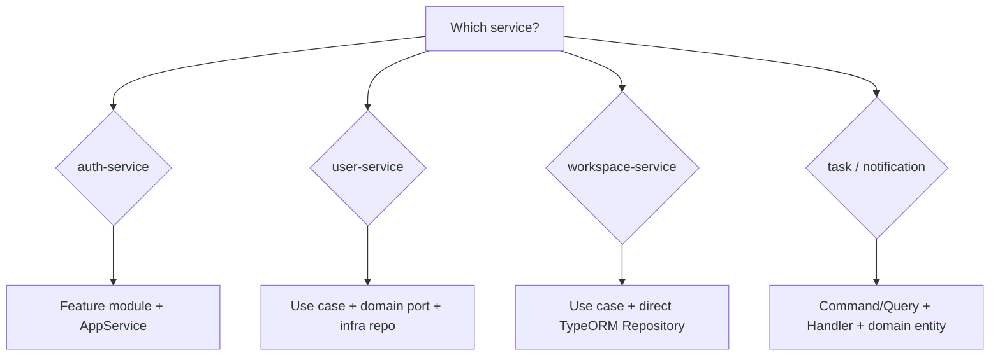

# CollabSpace Service Architecture Guide

This document tells AI agents **how each service is organized** and **where new code belongs**. CollabSpace is not a uniform monolith: each service uses a different layering style on purpose. **Always match the service you are editing**—do not copy patterns from another service unless the task explicitly crosses boundaries.

Read this before adding features, refactoring folders, or introducing new abstractions.

Related docs:

- `.claude/docs/coding-conventions.md` — DTO, errors, tests, events
- `.claude/docs/service-contracts.md` — HTTP/gRPC/event contracts
- `services/<name>/CLAUDE.md` — short service-local cheat sheet

---

## Golden rules (all services)

1. **Service boundary** — One database per service. No shared tables. Cross-service identity key is `userId`.
2. **Read neighbors first** — Open a similar file in the same folder before inventing structure.
3. **Thin transport** — Controllers parse HTTP/gRPC/events and delegate; business rules live deeper.
4. **Stable errors** — Prefer `{ code, message }` on Nest exceptions (match existing codes in that service).
5. **Events** — Include `eventId` + `occurredAt`; consumers must be idempotent (see `resilience.md`).
6. **Health** — Expose `/health`, `/health/live`, `/health/ready` with dependency checks where implemented.
7. **Docs** — Update `service-contracts.md` when routes, proto, or event payloads change.

---

## Quick comparison

| Service | Pattern | DB | Global prefix | API base | Port |
|---------|---------|-----|---------------|----------|------|
| auth-service | NestJS feature modules | Postgres / TypeORM | `api/v1` | `/api/v1/auth` | 3000 |
| user-service | Clean / hexagonal | Postgres / TypeORM | `api/v1` | `/api/v1/users` | 3000 |
| workspace-service | Layered (use case + TypeORM) | Postgres / TypeORM | `api/v1` | `/api/v1/workspaces` | **8080** |
| task-service | Clean + CQRS | Mongo / Mongoose | `api` + `v1/...` in controller | `/api/v1/tasks` | 3000 |
| notification-service | Clean + CQRS (event-driven) | Mongo / Mongoose | `api` + `v1/...` in controller | `/api/v1/notifications` | 3000 |

**Prefix inconsistency (intentional for now):** auth, user, and workspace set `app.setGlobalPrefix('api/v1')`. task and notification set `api` globally and put `v1/<resource>` on `@Controller()`.

---

## auth-service

**Path:** `services/auth-service`  
**Stack:** NestJS 11, TypeORM, PostgreSQL, Redis, gRPC, Graphile Worker outbox  
**Local context:** `services/auth-service/CLAUDE.md`

### Pattern: feature modules

Not hexagonal. Logic is split across:

- `AppService` — HTTP auth orchestration (register, login, OTP, refresh, `/me`)
- `modules/<feature>/*.service.ts` — feature-specific persistence and rules
- `modules/<feature>/entities/*.entity.ts` — TypeORM entities co-located with the module

### Folder map

```text
src/
├── app.controller.ts, app.service.ts     # HTTP entry + facade
├── auth.grpc.controller.ts               # gRPC VerifyAccessToken
├── common/types/                         # Plain TS input/output types (not class-validator DTOs)
├── configuration/                        # env.config.ts + ConfigurationService
├── health/
├── generated/proto/
└── modules/
    ├── database/
    ├── identity/          # users, roles, permissions, passwords
    ├── refresh-tokens/
    ├── redis/
    ├── outbox/            # email OTP events
    ├── emails/
    └── graphile-worker/
```

### Where to add code

| Task | Location |
|------|----------|
| New HTTP route | `app.controller.ts` or new root controller in `app.module.ts` |
| New auth flow step | `app.service.ts` (orchestration) + relevant `modules/*` service |
| User/role/password DB | `modules/identity/` |
| Refresh token behavior | `modules/refresh-tokens/` |
| Redis OTP/session | `modules/redis/` |
| Async email | `modules/outbox/` (not sync from controller) |
| gRPC for downstream | `auth.grpc.controller.ts` |
| Config / env | `configuration/env.config.ts` + `ConfigurationService` |
| Migration | `migrations/` + `scripts/sql/` |

### Conventions

- Path alias `@/*` → `src/*`
- Avoid scattered `process.env`; use `ConfigurationService`
- Input types in `common/types/*.type.ts`, not Nest DTO classes on controllers
- Passwords: scrypt; JWT: `jose` HS256; OTP hashed before Redis
- Register saga: rollback new auth user if user-service gRPC fails after insert

### Do not

- Put business logic only in controllers
- Send email synchronously from HTTP handlers when outbox exists
- Log passwords, OTPs, or tokens

---

## user-service

**Path:** `services/user-service`  
**Stack:** NestJS 11, TypeORM, PostgreSQL, gRPC server + auth gRPC client  
**Local context:** `services/user-service/CLAUDE.md`

### Pattern: clean / hexagonal

Strict dependency direction:

```text
presentation → application → domain (ports) → infrastructure
```

### Folder map

```text
src/
├── application/
│   ├── use-cases/*.use-case.ts    # One class per action, execute()
│   └── dto/                       # Response DTOs + toXxxResponseDto() mappers
├── domain/
│   ├── entities/                  # Plain domain classes (no ORM decorators)
│   └── repositories/              # Interface + Symbol token
├── infrastructure/
│   ├── database/entities/*.orm-entity.ts
│   ├── repositories/              # TypeORM + in-memory implementations
│   └── messaging/rabbitmq/
├── integrations/auth/             # auth-service gRPC client
└── presentation/
    ├── http/                      # REST + request DTOs (class-validator)
    ├── grpc/
    └── rabbitmq/
```

### Where to add code

| Task | Location |
|------|----------|
| HTTP endpoint | `presentation/http/*.controller.ts` |
| Request DTO | `presentation/http/dto/` |
| Use case | `application/use-cases/<name>.use-case.ts` |
| Response shape | `application/dto/` + mapper function |
| Domain model | `domain/entities/` |
| Repository contract | `domain/repositories/` + inject token |
| TypeORM entity | `infrastructure/database/entities/*.orm-entity.ts` |
| Repository impl | `infrastructure/repositories/` |
| External client | `integrations/` |
| Event consumer | `presentation/rabbitmq/` |

Register use cases in `app.module.ts`. Repository binding uses factory: TypeORM when `DATABASE_URL` is set, else in-memory.

### Conventions

- Use cases: `@Injectable()`, `execute(...)`, inject `@Inject(USER_PROFILE_REPOSITORY)`
- Never return ORM entities from controllers
- `me` routes resolve `userId` from bearer token via `AuthGrpcService`
- Relative imports (no `@/` alias)
- Update **both** TypeORM and in-memory repos when repository behavior changes

---

## workspace-service

**Path:** `services/workspace-service`  
**Stack:** NestJS, TypeORM, PostgreSQL, RabbitMQ (direct channel publish)  
**Local context:** `services/workspace-service/CLAUDE.md`

### Pattern: pragmatic layered NestJS

Folder names resemble clean architecture, but:

- **No** domain entities or repository interfaces today
- Use cases inject `Repository<OrmEntity>` from `@nestjs/typeorm` directly
- `domain/events/` holds event name constants and payload types only
- Events published inside use cases via injected RabbitMQ channel

### Folder map

```text
src/
├── application/
│   ├── dto/                       # Input DTOs (create, update, invite)
│   └── use-cases/
│       ├── workspace/
│       ├── project/
│       └── invitation/
├── domain/events/                 # WORKSPACE_INVITED_EVENT, payload types
├── health/
├── infrastructure/
│   ├── database/entities/*.orm-entity.ts
│   └── messaging/rabbitmq.module.ts
└── presentation/http/
    ├── workspace.controller.ts
    ├── project.controller.ts
    ├── invitation.controller.ts
    ├── health.controller.ts
    ├── guards/user-id.guard.ts
    └── decorators/user-id.decorator.ts
```

### Where to add code

| Task | Location |
|------|----------|
| HTTP route | `presentation/http/*controller.ts` |
| Auth guard / decorator | `presentation/http/guards/`, `decorators/` |
| Input validation DTO | `application/dto/` |
| Business action | `application/use-cases/<area>/<action>.use-case.ts` |
| DB table | `infrastructure/database/entities/*.orm-entity.ts` + migration |
| Event contract | `domain/events/` |
| Health | `health/` + `health.controller.ts` |

Register controllers and use cases in `app.module.ts`. Call `DatabaseService.initialize()` in `main.ts` before listen.

### Conventions

- Global prefix `api/v1`; routes under `/workspaces`, `/workspaces/:id/projects`, etc.
- Port **8080** (container), not 3000
- Public routes: `AuthGuard` + auth gRPC → `@UserId()` from `request.user.id`
- Internal S2S: `presentation/http/internal-workspace.controller.ts` + `assertInternalServiceAccess`
- ORM columns: snake_case (`workspace_id`, `owner_id`)
- Use `manager.transaction()` for multi-table writes
- Tests: `*.use-case.spec.ts` next to use case
- RabbitMQ: exchange `collabspace_exchange`, routing keys from `domain/events`

### Do not

- Introduce repository ports unless refactoring the whole service (not default for small changes)
- Assume port 3000
- Trust `userId` from request body on protected routes

---

## task-service

**Path:** `services/task-service`  
**Stack:** NestJS, CQRS, Mongoose, RabbitMQ publisher, Azure Blob (attachments)  
**Local context:** `services/task-service/CLAUDE.md`

### Pattern: clean architecture + CQRS

```text
Controller → CommandBus / QueryBus → Handler → Domain → Repository port → Mongo repo
```

### Folder map

```text
src/
├── application/
│   ├── commands/*.command.ts
│   ├── queries/*.query.ts
│   ├── ports/ITaskRepository.ts, IUserReplicaRepository.ts
│   └── usecases/*.handler.ts
│       └── comments/              # Grouped sub-features
├── domain/
│   ├── entities/
│   ├── value-objects/
│   ├── events/
│   └── exceptions/
├── infrastructure/
│   ├── persistence/*.schema.ts    # Mongoose schemas
│   ├── repositories/
│   ├── mappers/
│   ├── messaging/rabbitmq/
│   └── services/                  # Azure blob, workspace mock, etc.
└── presentation/
    ├── controllers/               # HTTP + internal/ event listeners
    ├── dtos/
    ├── guards/
    └── common/response/           # ok(), created() wrappers
```

### Where to add code

| Task | Location |
|------|----------|
| HTTP endpoint | `presentation/controllers/*.controller.ts` |
| Request/response DTO | `presentation/dtos/` |
| Write operation | `application/commands/` + `application/usecases/*handler.ts` |
| Read operation | `application/queries/` + handler |
| Domain rules | `domain/entities/` (factory methods, getters) |
| Repository interface | `application/ports/` or `domain/repositories/` |
| Mongo schema | `infrastructure/persistence/*.schema.ts` |
| Persistence | `infrastructure/repositories/` + mapper |
| Publish event | handler after successful save; payload in `domain/events/` |
| RMQ consumer | `presentation/controllers/internal/` |

Add new handlers to the `Handlers` array in `app.module.ts`.

### Conventions

- Global prefix `api`; controllers use `@Controller('v1/tasks')` → `/api/v1/tasks`
- Double-quote style in this service (match existing files)
- Handlers: `@CommandHandler` / `@QueryHandler`, `execute()`
- Domain throws `BusinessRuleException`, `EntityNotFoundException`
- User context from `AuthGuard` → `request.user` (`presentation/http/request-context.ts`)
- `@UseGuards(AuthGuard, WorkspaceValidationGuard)` on task/comment controllers
- Workspace membership: `WorkspaceHttpClient` → internal API + `INTERNAL_SERVICE_TOKEN`
- Auth integration: `src/integrations/auth/` (gRPC proto + `AuthGrpcService`)
- Event payloads include `eventId` + `occurredAt`
- Tests: `*.handler.spec.ts`

### Do not

- Put Mongo queries in controllers
- Use single-quote style if the file around you uses double quotes
- Skip registering handlers in `app.module.ts`

---

## notification-service

**Path:** `services/notification-service`  
**Stack:** NestJS, CQRS, Mongoose, RabbitMQ consumer  
**Local context:** `services/notification-service/CLAUDE.md`

### Pattern: clean + CQRS, event-first

Primary entry is RabbitMQ listeners; HTTP is list + health.

```text
Event listener → CommandBus → CreateNotificationHandler → Domain → Mongo
```

### Folder map

```text
src/
├── application/usecases/
│   ├── create-notification/
│   │   ├── create-notification.command.ts
│   │   └── create-notification.handler.ts
│   └── get-notifications/
│       ├── get-notifications.query.ts
│       └── get-notifications.handler.ts
├── domain/
│   ├── entities/Notification.ts
│   ├── repositories/            # INotificationRepository, IProcessedEventRepository
│   ├── value-objects/NotificationType.ts
│   └── events/                    # Consumer-side payload types
├── health/
├── infrastructure/database/
│   ├── schemas/
│   └── repositories/
└── presentation/controllers/
    ├── notifications.controller.ts
    └── internal/*-event-listener.controller.ts
```

### Where to add code

| Task | Location |
|------|----------|
| New event type | `domain/events/` + `presentation/controllers/internal/*listener*` |
| Create notification flow | extend `CreateNotificationCommand` / handler or new use-case folder |
| List/read API | `get-notifications/` or new query handler |
| Domain entity rules | `domain/entities/` |
| Dedupe / idempotency | `ProcessedEvent` schema + `tryClaim(eventId)` in handler |
| Mongo schema | `infrastructure/database/schemas/` |
| Repository | `domain/repositories/` interface + `infrastructure/database/repositories/` |

Bind repositories with tokens in `app.module.ts` (`NOTIFICATION_REPOSITORY_TOKEN`, etc.).

### Conventions

- Global prefix `api`; `@Controller('v1/notifications')`
- Protected list/read routes: `@UseGuards(AuthGuard)` — JWT via auth gRPC, not `X-User-Id` header
- Auth integration: `src/integrations/auth/`; env `AUTH_SERVICE_GRPC_URL`, `ALLOW_DEV_IDENTITY_HEADERS`
- One folder per use case under `application/usecases/<name>/`
- Listeners: `@EventPattern`, build `CreateNotificationCommand` with `eventId`
- Handler claims `eventId` before insert (duplicate → no-op success)
- Readiness checks Mongo + RabbitMQ when consumer enabled
- Tests: `*.handler.spec.ts`, listener `*.spec.ts`

### Do not

- Create notifications without `eventId` from producers (derive fallback only for legacy messages)
- Ack RabbitMQ message before handler succeeds

---

## Choosing the right pattern (for agents)



When unsure, run:

```sh
# See how similar feature is implemented
ls services/<service>/src
head -30 services/<service>/src/app.module.ts
```

---

## Cross-service integration map

| From | To | Mechanism |
|------|-----|-----------|
| auth-service | user-service | gRPC `CreatePendingProfile`, `GetProfile` |
| user-service | auth-service | gRPC `VerifyAccessToken` |
| workspace-service | notification | RabbitMQ `workspace_invited` |
| task-service | notification | RabbitMQ `task_assigned`, `comment_created` |
| API gateway | all HTTP services | Traefik routes + forward-auth to auth `/verify` |

---

## Maintenance

Update this file when:

- A service gains a new top-level folder or architectural layer
- Global prefix or port conventions change
- A service moves toward repository ports (e.g. workspace refactor)
- MVP status changes materially (see also `project-architecture.md`)
