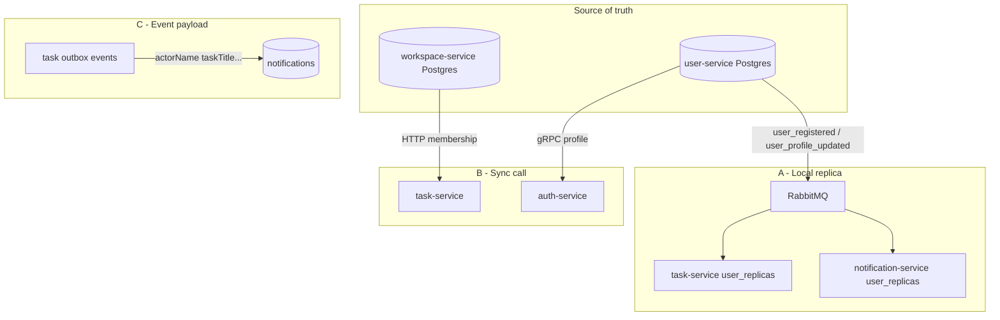

# CollabSpace — Dữ liệu xuyên service (không JOIN database)

Tài liệu này giải thích **cách dự án thay thế JOIN SQL** giữa database của các microservice. Chi tiết kỹ thuật cho dev/agent (tiếng Anh): [`.claude/docs/read-models.md`](../.claude/docs/read-models.md). Event contract: [`.claude/docs/service-contracts.md`](../.claude/docs/service-contracts.md).

---

## 1. Vấn đề

Trong monolith, có thể:

```sql
SELECT t.*, u.full_name
FROM tasks t
JOIN users u ON t.creator_id = u.id;
```

Trong CollabSpace **không làm vậy**:

| Service | Database | Ví dụ dữ liệu |
|---------|----------|---------------|
| `user-service` | PostgreSQL | profile, `username`, avatar |
| `task-service` | MongoDB | task, comment, `user_replicas` |
| `workspace-service` | PostgreSQL | workspace, membership |
| `notification-service` | MongoDB | notification, `user_replicas` |

Mỗi service **sở hữu schema riêng**. Câu hỏi kiến trúc: khi `task-service` cần tên user, lấy ở đâu?

---

## 2. Ba chiến lược CollabSpace dùng

```
┌─────────────────────────────────────────────────────────────────┐
│  A. Local replica + event sync   ← pattern chính (user data)   │
│  B. Gọi sync HTTP/gRPC           ← quyền, membership, /me      │
│  C. Denormalize trong event      ← payload one-shot (noti)     │
└─────────────────────────────────────────────────────────────────┘
```

| Chiến lược | Khi nào | Ưu | Nhược |
|------------|---------|-----|-------|
| **A. Replica + event** | Đọc user directory **nhiều lần** | Nhanh, không gọi user-service mỗi request | Eventual consistency (lag ngắn) |
| **B. Sync HTTP/gRPC** | **Authorization**, dữ liệu phải **đúng ngay** | Luôn fresh | Phụ thuộc service kia, chậm hơn |
| **C. Denormalize event** | Ghi notification / side-effect một lần | Đơn giản lúc consume | Bản cũ không tự cập nhật nếu không có replica |

---

## 3. Pattern chính: Local read model (user directory)

Đây là cách dự án **thay JOIN** cho hầu hết nhu cầu liên quan user.

### 3.1 Source of truth

- **`user-service`** + PostgreSQL là nơi **duy nhất ghi** profile user.
- Các service khác **không** truy vấn trực tiếp DB user-service.

### 3.2 Đồng bộ bằng event

Khi profile thay đổi, `user-service` publish qua RabbitMQ:

| Event | Khi nào |
|-------|---------|
| `user_registered` | Tạo pending profile (sau register) |
| `user_profile_updated` | User cập nhật profile / username |

Payload có `occurredAt` để đo độ trễ sync.

**Consumer:** `task-service`, `notification-service` → upsert collection Mongo **`user_replicas`**.

### 3.3 Schema replica (subset field)

Collection `user_replicas` (Mongo) — không copy toàn bộ bảng user:

| Field | Mục đích |
|-------|----------|
| `userId` | Khóa chính |
| `username` | Index — resolve `@mention` |
| `fullName`, `displayName`, `avatarUrl` | Hiển thị UI / embed task |
| `isActive` | Từ chối user đã khóa |

Code: `services/task-service/src/infrastructure/persistence/user-replica.schema.ts` (notification-service có schema tương tự).

### 3.4 Đọc local — không JOIN

| Luồng nghiệp vụ | Service | Cách lấy user |
|-----------------|---------|---------------|
| Tạo task | task-service | `UserReplicaLookupService.findActiveByIdAsync(creatorId)` |
| Assign task | task-service | assigner + assignee từ replica |
| Comment | task-service | author by id; `@username` → `findActiveByUsernameAsync` |
| List notification | notification-service | batch load actor từ `user_replicas` |

Handler **không** gọi `user-service` trên happy path — đọc DB local.

### 3.5 Fallback khi replica thiếu

Race phổ biến: user vừa register, event chưa tới → replica chưa có.

Luồng `UserReplicaLookupService`:

1. Đọc `user_replicas` local.
2. Nếu thiếu / inactive → `POST /api/v1/users/internal/replicas` (user-service, header `X-Internal-Service-Token`).
3. Upsert replica → đọc lại.

Env (consumer):

```env
USER_SERVICE_URL=http://user-service:3000
USER_SERVICE_TIMEOUT_MS=3000
USER_REPLICA_FALLBACK_ENABLED=true
INTERNAL_SERVICE_TOKEN=
```

### 3.6 Denormalize thêm trong aggregate Task

Sau khi đọc replica, task-service embed **`UserSnapshot`** vào document/event Task lúc **ghi** — tránh phải tra user mỗi lần đọc lịch sử task (CQRS / event sourcing).

---

## 4. Luồng ví dụ: user đổi tên

```
1. PATCH /users/me          → user-service cập nhật Postgres
2. Publish user_profile_updated (occurredAt = T0)
3. RabbitMQ → task-service + notification-service
4. Upsert user_replicas (fullName, username mới)
5. GET /notifications       → actor.name từ replica (tên mới)
6. Comment @username mới    → resolve từ replica local
```

**Lưu ý:** giữa bước 2 và 4 có **lag ngắn** (eventual consistency). Metric Prometheus: `user_replica_sync_lag_seconds`.

---

## 5. Các boundary khác — không dùng replica

### task-service ↔ workspace-service

- **Không** có `workspace_replicas`.
- Kiểm tra membership: HTTP sync tới `workspace-service` (`WORKSPACE_CLIENT_MODE=http`).
- **Lý do:** quyền workspace phải **đúng ngay**, không chấp nhận lag replica.

### auth-service ↔ user-service

- **Không** giữ replica trong auth.
- `GET /auth/me`: gRPC sang user-service lấy profile.
- **Lý do:** endpoint identity; tần suất vừa phải, cần tương đối fresh.

### Notification: tạo vs list

| Thời điểm | Cách lấy dữ liệu user |
|-----------|------------------------|
| **Lúc tạo** (consumer event) | Denormalize: `actorName`, `taskTitle` trong payload → lưu `metadata` |
| **Lúc list** (`GET /notifications`) | **Ưu tiên replica** cho actor; fallback `metadata` nếu replica thiếu |

---

## 6. Bảng tổng hợp

| Nhu cầu “join” | Giải pháp | JOIN SQL? |
|----------------|-----------|-----------|
| Tên user trong task/comment | `user_replicas` + event + fallback | Không |
| `@mention` | `user_replicas.username` | Không |
| Actor trong list notification | `user_replicas` batch | Không |
| User trên task document | `UserSnapshot` embed lúc write | Không |
| Workspace membership | HTTP sync workspace-service | Không |
| Profile trên `/auth/me` | gRPC user-service | Không |
| Nội dung notification lúc ghi | Denormalize trong event | Không |

---

## 7. Sơ đồ kiến trúc



---

## 8. Nguyên tắc khi thêm tính năng mới

1. **Đọc user directory thường xuyên** → dùng / mở rộng `user_replicas` + event (xem [read-models.md](../.claude/docs/read-models.md)).
2. **Kiểm tra quyền, membership** → gọi sync service owner (HTTP/gRPC + timeout).
3. **Side-effect one-shot** → có thể denormalize trong event; vẫn nên enrich từ replica khi list nếu cần tên mới nhất.
4. **Không** thêm FK hoặc JOIN xuyên database service.

---

## Tài liệu liên quan

| Tài liệu | Nội dung |
|----------|----------|
| [read-models.md](../.claude/docs/read-models.md) | Quy ước implement, env, metrics |
| [service-contracts.md](../.claude/docs/service-contracts.md) | Event payload, internal API |
| [project-architecture.md](../.claude/docs/project-architecture.md) | Topology, port, datastore |
| [resilience-overview.md](./resilience-overview.md) | Chịu lỗi, eventual consistency |
| [nfrs.md](./nfrs.md) | Thuộc tính chất lượng (NFRs) |
| [trade-offs.md](./trade-offs.md) | Trade-off kiến trúc |
