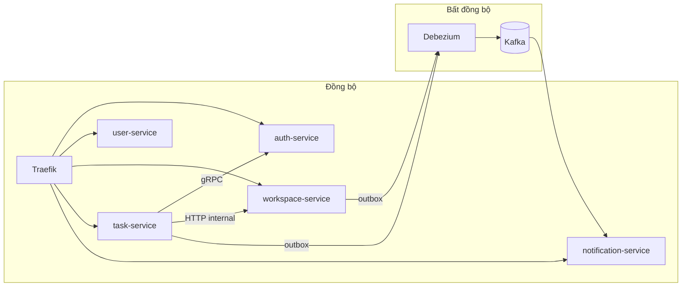

# Design Patterns trong CollabSpace

Tài liệu này mô tả **các design pattern và architectural pattern** đang dùng trong repo, kèm **đường dẫn file cụ thể** và hướng dẫn khi nào nên áp dụng thêm.

Tài liệu kỹ thuật agent (tiếng Anh): [`.claude/docs/service-architecture.md`](../.claude/docs/service-architecture.md).

---

## 1. Tổng quan kiến trúc

| Pattern | Mô tả ngắn | Phạm vi |
|---------|------------|---------|
| **Microservices** | Mỗi service một DB, giao tiếp HTTP/gRPC/events | Toàn repo |
| **API Gateway** | Traefik route `/api/v1/*`, Swagger `/swagger/<service>` | `api-gateway/` |
| **Hexagonal / Clean Architecture** | `presentation → application → domain ← infrastructure` | auth, user, workspace |
| **CQRS** | Tách Command/Query + Handler | task, notification |
| **Event-Driven** | Kafka + Debezium CDC (transactional outbox → topics) | workspace, user, task, notification |
| **Transactional Outbox** | Ghi event cùng transaction DB, poll publish sau | auth, workspace, task |
| **Event Sourcing** (một phần) | Task aggregate append `task_events`, projection `tasks` | task-service |
| **Saga / Choreography** | Luồng đăng ký auth → user profile; invite → notification | cross-service |
| **Idempotency** | `ProcessedEvent.tryClaim`, `IdempotencyKey` | notification, task |
| **Read Replica / Anti-Corruption** | `UserReplica` trong task-service | task-service |
| **Forward Auth** | JWT verify qua auth gRPC `VerifyAccessToken` | user, workspace, task, notification |



---

## 2. Pattern theo lớp (cross-cutting)

### 2.1 Repository Pattern

**Mục đích:** Domain/application chỉ biết **port interface**; persistence nằm ở infrastructure.

| Service | Port (interface) | Adapter |
|---------|------------------|---------|
| auth | `domain/repositories/user.repository.ts` | `infrastructure/repositories/typeorm-user.repository.ts` |
| user | `domain/repositories/user-profile.repository.ts` | `infrastructure/repositories/typeorm-user-profile.repository.ts` |
| workspace | `domain/repositories/*.repository.ts` | `infrastructure/repositories/typeorm-*.repository.ts` |
| task | `application/ports/ITaskRepository.ts`, `domain/repositories/comment.repository.interface.ts` | `infrastructure/repositories/*` |
| notification | `domain/repositories/notification.repository.ts` | `infrastructure/database/repositories/mongo-notification.repository.ts` |

**Khi thêm feature:** định nghĩa method trên port trước, implement adapter sau; use case/handler chỉ inject token Symbol.

---

### 2.2 Dependency Injection (NestJS)

Toàn bộ service dùng constructor injection + `@Injectable()`. Module binding:

- `useClass` — implementation mặc định
- `useExisting` — alias cùng instance
- `useFactory` — chọn TypeORM vs in-memory (user-service), HTTP vs mock workspace client (task-service)

Ví dụ: `services/task-service/src/app.module.ts` — `Handlers` array, repository tokens.

---

### 2.3 DTO + Mapper

- **Request DTO:** `class-validator` ở presentation/application
- **Response DTO:** không trả ORM entity ra HTTP
- **Mapper:** `infrastructure/mappers/`, `application/dto/*-mapper.ts`

Notification-service bổ sung **InboundNotificationEventMapper** (Factory): event payload → `CreateNotificationCommand`.

- File: `services/notification-service/src/application/mappers/inbound-notification-event.mapper.ts`

---

### 2.4 Port & Adapter (Hexagonal)

Outbound integrations là **ports** ở domain/application, **adapters** ở infrastructure/integrations:

| Port | Adapter | Service |
|------|---------|---------|
| `EMAIL_OUTBOX` | `AuthOutboxService` + processor | auth |
| `USER_PROFILE_CLIENT` | gRPC client | auth |
| `WORKSPACE_CLIENT` | `WorkspaceHttpClient` | task |
| `OTP_STORE` | Redis adapter | auth |

---

### 2.5 Transactional Outbox

Luồng chuẩn:

1. Use case/handler ghi business data + row outbox **trong cùng transaction**
2. `*OutboxProcessor` poll định kỳ: reclaim stale → claim batch → publish → mark processed/failed

**Template Method dùng chung** (mới áp dụng):

- `packages/shared/src/outbox/outbox-poll-cycle.ts` — `runOutboxPollCycle()`
- Auth: `services/auth-service/src/infrastructure/outbox/auth-outbox.processor.ts`
- Workspace: `services/workspace-service/src/infrastructure/outbox/workspace-outbox.processor.ts`
- Task: `services/task-service/src/infrastructure/outbox/task-outbox.processor.ts`

Cấu hình:

- Auth: `ConfigurationService.getOutboxConfig()`
- Workspace: `workspace-outbox.config.ts`
- Task: `TASK_OUTBOX_ENABLED`, `TASK_OUTBOX_POLL_INTERVAL_MS`

---

### 2.6 Strategy Pattern

**Auth outbox publish** — registry map `eventType` → handler:

- `services/auth-service/src/infrastructure/outbox/auth-outbox-publish.registry.ts`
- Thay thế `switch` trong processor; thêm event mới = `handlers.set(...)` trong registry

**Task outbox publish** — strategy inline trong `TaskOutboxProcessor.publishEvent()` (có thể tách registry tương tự auth khi thêm nhiều event type).

---

### 2.7 Factory Pattern

| Factory | Vai trò | File |
|---------|---------|------|
| Domain entity factories | `Task.create()`, `Comment.create()` | `task-service/domain/entities/` |
| Notification command factory | Build `CreateNotificationCommand` từ Kafka payload | `notification-service/.../inbound-notification-event.mapper.ts` |
| JWT / session | `SessionIssuerService` | auth-service |

---

### 2.8 Template Method

| Vị trí | Skeleton cố định | Bước biến đổi |
|--------|------------------|---------------|
| Outbox poll | `runOutboxPollCycle` | `publish`, `claimPendingBatch`, … |
| Kafka consumer | `consumeNotificationEvent` | `CreateNotificationCommand` từ mapper |
| CQRS handler | `execute(command)` | logic từng use case |

Kafka consumer helper:

- `services/notification-service/src/presentation/helpers/kafka-notification-consumer.helper.ts`

---

### 2.9 Specification Pattern

Query fragments tái sử dụng cho MongoDB comment queries:

- `services/task-service/src/domain/specifications/comment.specifications.ts`
- Dùng trong `infrastructure/repositories/comment.repository.ts`

Ví dụ:

```typescript
CommentSpecs.topLevelForTask(taskId)  // parentId: null, not deleted
CommentSpecs.repliesOf(parentId)
```

**Khi mở rộng:** thêm spec mới thay vì copy object query rải rác.

---

### 2.10 Policy Pattern

Business rules tách khỏi handler:

- `services/task-service/src/domain/policies/comment-notification.policy.ts`
  - `shouldNotifyAssignee(assigneeId, authorId)`
  - `mentionRecipients(mentionedUserIds, assigneeId)`

Test: `comment-notification.policy.spec.ts`

---

### 2.11 Facade Pattern

Che giấu chi tiết outbox phía sau API đơn giản:

- `services/task-service/src/application/services/task-comment-notification.publisher.ts`
  - `publishForNewComment()` — handler không gọi `TaskOutboxService` trực tiếp

---

### 2.12 Value Object

| VO | Service | File |
|----|---------|------|
| `TaskId`, `UserSnapshot` | task | `domain/value-objects/` |
| `CommentPreview` | task | `domain/value-objects/CommentPreview.ts` |
| `NotificationType` | notification | `domain/value-objects/NotificationType.ts` |

`CommentPreview.fromContent(content)` — truncate 50 ký tự cho notification.

---

### 2.13 Rich Domain Model

Entity mang business invariant, không chỉ data bag:

| Entity | Rules | File |
|--------|-------|------|
| `Task` | status transition, assign, attachments | `task-service/domain/entities/Task.ts` |
| `Comment` | `addMention`, edit rules | `task-service/domain/entities/comment.entity.ts` |
| `Invitation` | `assertCanAccept()`, `assertCanReject()` | `workspace-service/domain/entities/invitation.entity.ts` |

Domain exception:

- `workspace-service/src/domain/exceptions/invitation.exceptions.ts` — `InvitationInvalidStateError`
- Repository/use case map sang `BadRequestException`

Test: `invitation.entity.spec.ts`

---

### 2.14 CQRS (Command Query Responsibility Segregation)

**task-service:**

- Commands: `application/commands/` + `*handler.ts`
- Queries: `application/queries/` + handler
- `CommandBus` / `QueryBus` từ `@nestjs/cqrs`

**notification-service:**

- `CreateNotificationCommand` + handler
- List: query handler `get-notifications/`

---

### 2.15 Event Sourcing (Task aggregate)

- Ghi: append `TaskEventPersistence` qua `ITaskEventStore`
- Đọc: projection `TaskPersistence` hoặc rebuild từ events
- File: `event-sourced-mongo-task.repository.ts`, `mongo-task-event.store.ts`

Legacy task `version = 0` vẫn load từ projection cho đến lệnh ghi tiếp theo.

---

### 2.16 Idempotency

**notification-service:**

- `ProcessedEvent` + `tryClaim(eventId)` trước khi insert notification
- Listener luôn truyền `eventId` từ producer

**task-service:**

- `IdempotencyService` + `IdempotencyKeyRecord` cho HTTP idempotent writes

---

### 2.17 Guard / Middleware (Security)

| Guard | Service | Vai trò |
|-------|---------|---------|
| `AuthGuard` | task, notification, workspace | Bearer → auth gRPC |
| `WorkspaceValidationGuard` | task | Membership qua workspace internal API |
| Dev fallback | nhiều service | `X-User-Id` khi `ALLOW_DEV_IDENTITY_HEADERS=true` |

---

### 2.18 Observer / Event Listener

Kafka consumers (`@collabspace/shared` `processKafkaConsumerMessage`):

- `notification-service/src/infrastructure/messaging/kafka/*-kafka.consumer.ts`
- `task-service/src/infrastructure/messaging/kafka/*-kafka.consumer.ts` — user replica sync, workspace cleanup

Sau refactor: listener mỏng → mapper + `consumeNotificationEvent`.

---

### 2.19 Shared Kernel

Package `@collabspace/shared`:

- Event contracts + routing constants: `packages/shared/src/events/`
- Outbox poll cycle: `packages/shared/src/outbox/`

Consumer: workspace, task, notification, **auth** (outbox poll).

---

## 3. Pattern theo service

### auth-service

| Pattern | Vị trí chính |
|---------|--------------|
| Clean Architecture | `presentation` → `application/use-cases` → `domain` → `infrastructure` |
| Repository | `UserRepository`, `RefreshTokenRepository` ports |
| Outbox + Template Method | `auth-outbox.processor.ts` + shared `runOutboxPollCycle` |
| Strategy Registry | `auth-outbox-publish.registry.ts` |
| OTP / Session | Redis + `SessionIssuerService` |
| gRPC server | `auth.grpc.controller.ts` — `VerifyAccessToken` |

### user-service

| Pattern | Vị trí chính |
|---------|--------------|
| Use case per action | `application/use-cases/*.use-case.ts` |
| gRPC + HTTP | `presentation/grpc`, `presentation/http` |
| Repository factory | TypeORM vs in-memory theo `DATABASE_URL` |

### workspace-service

| Pattern | Vị trí chính |
|---------|--------------|
| Use case | `application/use-cases/workspace|project|invitation/` |
| Rich domain | `Invitation.assertCanAccept/Reject` |
| Outbox | `WorkspaceOutboxService`, processor dùng shared poll cycle |
| TypeORM transaction | `TypeOrmInvitationRepository.createAndPublishInvited` |

### task-service

| Pattern | Vị trí chính |
|---------|--------------|
| CQRS handlers | `application/usecases/` |
| Event sourcing | Task aggregate + event store |
| Policy + Facade + VO | comment notification flow |
| Specification | `CommentSpecs` |
| Outbox Mongo | `task-outbox.service.ts`, processor |
| Anti-corruption | `UserReplica`, `UserReplicaLookupService` |

### notification-service

| Pattern | Vị trí chính |
|---------|--------------|
| Event-driven consumer | internal listeners |
| Factory mapper | `InboundNotificationEventMapper` |
| Template Method | `consumeNotificationEvent` |
| Idempotency | `ProcessedEvent` trong create handler |

---

## 4. Luồng ví dụ (end-to-end)

### 4.1 Comment → Notification

```text
POST /api/v1/tasks/:id/comments
  → CreateCommentHandler
  → CommentNotificationPolicy (ai nhận noti?)
  → TaskCommentNotificationPublisher (Facade)
  → TaskOutboxService.enqueue* (cùng transaction Mongo)
  → Debezium CDC → Kafka collabspace.task.*
  → notification-service Kafka consumer
  → InboundNotificationEventMapper (Factory)
  → consumeNotificationEvent (Template Method)
  → CreateNotificationHandler (idempotent)
```

### 4.2 Workspace invite

```text
POST invite → use case → transaction(outbox row)
  → Debezium CDC → Kafka collabspace.workspace.workspace_invited
  → notification-service Kafka consumer → notification persisted
```

### 4.3 Auth email OTP

```text
Register use case → AuthOutboxService (transaction)
  → AuthOutboxProcessor → AuthOutboxPublishRegistry (Strategy)
  → EmailsService.sendMailNow
```

---

## 5. Hướng dẫn mở rộng

| Tình huống | Pattern nên dùng |
|------------|------------------|
| Thêm outbox event type (auth) | Đăng ký handler trong `AuthOutboxPublishRegistry` |
| Thêm Kafka event → notification | Thêm method trong `InboundNotificationEventMapper` + consumer mỏng |
| Query Mongo lặp lại | Thêm spec trong `CommentSpecs` (hoặc file spec mới theo aggregate) |
| Rule “ai được notify” | Policy class trong `domain/policies/` |
| Invariant entity (invite, task status) | Method trên domain entity + domain exception |
| Poll outbox service mới | Dùng `runOutboxPollCycle` từ `@collabspace/shared` |
| Cross-service contract | Định nghĩa payload trong `packages/shared/src/events/` |

**Tránh:**

- Business rule trong controller hoặc ORM entity
- Commit Kafka offset chỉ sau khi handler thành công (hoặc publish DLQ)
- Notification không có `eventId`
- Copy-paste poll loop outbox thay vì dùng shared cycle

---

## 6. Thay đổi gần đây (design pattern rollout)

| Thay đổi | Files |
|----------|-------|
| Shared outbox Template Method | `packages/shared/src/outbox/` |
| Auth Strategy registry | `auth-outbox-publish.registry.ts` |
| Task Policy + Facade + VO + Spec | `domain/policies/`, `CommentPreview`, `task-comment-notification.publisher.ts`, `comment.specifications.ts` |
| Invitation rich domain | `invitation.entity.ts`, `invitation.exceptions.ts` |
| Notification Factory + Kafka consumer helper | `inbound-notification-event.mapper.ts`, `kafka-notification-consumer.helper.ts` |

---

## 7. Tài liệu liên quan

- [service-architecture.md](../.claude/docs/service-architecture.md) — folder layout từng service
- [service-contracts.md](../.claude/docs/service-contracts.md) — HTTP, gRPC, events
- [resilience.md](../.claude/docs/resilience.md) — outbox, idempotency, degradation
- [cross-service-data.md](./cross-service-data.md) — read models, replicas
- [features.md](./features.md) — trạng thái tính năng
