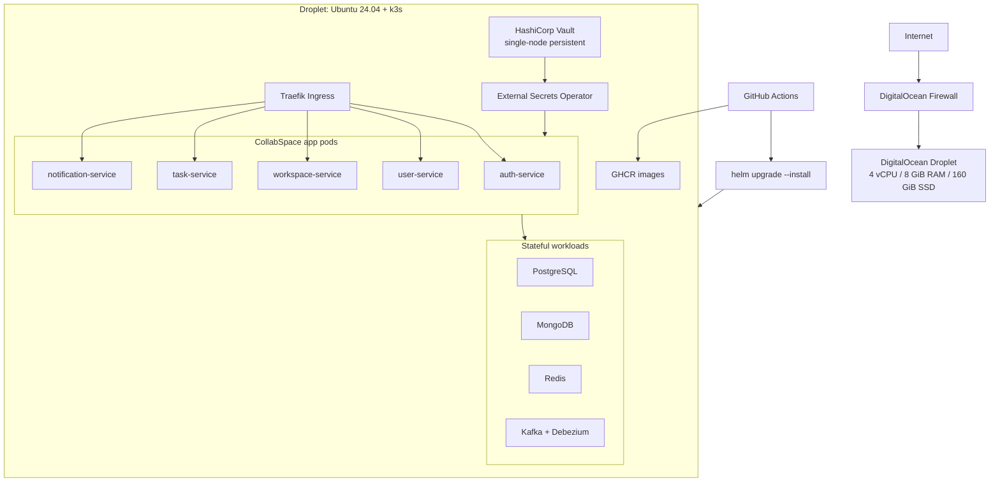
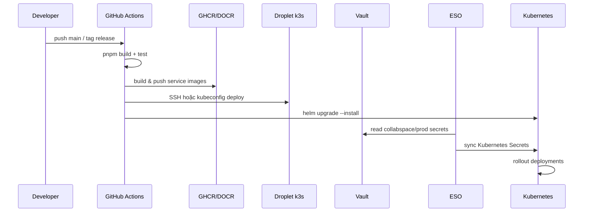

# CollabSpace trên DigitalOcean: phương án triển khai production

> **Lộ trình triển khai theo phase (k3s):** [deployment-k3s-phases.md](./deployment-k3s-phases.md)  
> **Deploy legacy Compose:** [deployment-digitalocean-droplet.md](./deployment-digitalocean-droplet.md)  
> **Chỉ mục tài liệu:** [README.md](./README.md)

Ngày 2026-06-12, phương án được chọn cho CollabSpace là:

```text
DigitalOcean Droplet 4 vCPU / 8 GiB RAM / 160 GiB SSD
  -> Ubuntu 24.04
  -> k3s single-node Kubernetes
  -> Helm chart CollabSpace
  -> Vault + External Secrets Operator
  -> Traefik ingress
  -> PostgreSQL / MongoDB / Redis / Kafka + Debezium Connect trong cluster
```

Đây là môi trường production trên DigitalOcean cho giai đoạn MVP/demo/staging-public. Phương án này rẻ hơn DOKS 3 node, vẫn dùng được Kubernetes workflow thật, nhưng chưa phải mô hình HA production đầy đủ.

## Kết Luận

Chọn **1 Droplet chạy k3s single-node** thay vì **DOKS 3 node + HA control plane**.

Lý do chính:

- Chi phí DOKS 3 node trong cấu hình đang xem là khoảng **112 USD/tháng**: 3 Basic nodes **72 USD/tháng** + HA control plane **40 USD/tháng**.
- Droplet hiện tại là **48 USD/tháng** cho 4 vCPU, 8 GiB RAM, 160 GiB SSD.
- CollabSpace hiện tại là MVP/demo, chưa có traffic production thật lớn.
- Dự án đã có Helm chart, Vault/ESO manifests và service discovery bằng Kubernetes, nên k3s single-node vẫn giữ được luồng triển khai gần production.
- Khi cần HA thật, có thể nâng cấp lên DOKS sau mà không phải viết lại app, vì workload đã được đóng gói theo Kubernetes/Helm.

Giá tham khảo:

- DigitalOcean Droplet Basic Regular 4 vCPU / 8 GiB RAM / 160 GiB SSD: **48 USD/tháng**.
- DigitalOcean Kubernetes HA control plane: **40 USD/tháng**.
- DigitalOcean Kubernetes tính phí theo worker node; Load Balancer và Block Storage có thể phát sinh thêm chi phí.

Nguồn tham khảo:

- DigitalOcean Droplet pricing: https://www.digitalocean.com/pricing/droplets
- DigitalOcean Kubernetes pricing: https://www.digitalocean.com/pricing/kubernetes

## Các Phương Án Trên DigitalOcean

### Option A: 1 Droplet + Docker Compose

```text
Droplet
  -> Docker Compose
      -> auth-service
      -> user-service
      -> workspace-service
      -> task-service
      -> notification-service
      -> postgres / mongo / redis / kafka / debezium-connect
      -> traefik
      -> vault
```

Ưu điểm:

- Rẻ nhất và dễ vận hành nhất.
- Phù hợp với demo nhanh.
- CI/CD qua SSH và `docker compose up` đơn giản.

Nhược điểm:

- Không học/vận hành Kubernetes đúng nghĩa.
- Service discovery chỉ nằm trong Docker network trên một máy.
- Sau này chuyển sang Kubernetes sẽ cần thêm một bước migration deploy.

Kết luận: tốt cho demo rất sớm, nhưng không phải hướng nên chọn tiếp theo vì dự án đã có Helm/K8s manifests.

### Option B: 1 Droplet + k3s single-node

```text
Droplet
  -> k3s
      -> Kubernetes DNS
      -> Helm release
      -> Traefik ingress
      -> Vault + ESO
      -> app pods
      -> data-store pods + PVC
```

Ưu điểm:

- Chi phí giữ ở mức Droplet hiện tại.
- Có Kubernetes Service DNS thật:

```text
workspace-service.collabspace.svc.cluster.local
  -> Kubernetes Service
  -> Pod đang chạy trên node
```

- Dùng được Helm chart của dự án.
- Dùng được Vault + External Secrets Operator theo hướng production.
- CI/CD có thể dùng `helm upgrade --install`, gần với cách deploy lên DOKS sau này.
- Ít thay đổi hơn khi nâng cấp lên DOKS.

Nhược điểm:

- Single point of failure: Droplet chết thì cluster chết.
- Không có multi-node scheduling thật sự.
- Database, Vault và app cùng nằm trên một máy.
- Cần backup/snapshot nghiêm túc hơn vì toàn bộ workload nằm trên một Droplet.

Kết luận: **chọn option này cho production giai đoạn đầu trên DigitalOcean**.

### Option C: DOKS 3 node không HA control plane

```text
DOKS
  -> 3 worker nodes
  -> managed Kubernetes control plane
  -> app pods spread across nodes
```

Ưu điểm:

- Gần production hơn single-node k3s.
- Pod có thể chạy trên nhiều node.
- Rolling update và node maintenance tốt hơn.
- Không cần tự cài Kubernetes control plane.

Nhược điểm:

- Chi phí cao hơn Droplet.
- Vẫn có chi phí Load Balancer, PVC/Block Storage, backup.
- Nếu không bật HA control plane thì control plane chưa có SLA cao nhất.

Kết luận: nên dùng khi CollabSpace có người dùng thật hoặc cần staging gần production hơn.

### Option D: DOKS 3 node + HA control plane

```text
DOKS
  -> 3 worker nodes
  -> HA control plane
  -> Load Balancer
  -> PVC / managed data stores
```

Ưu điểm:

- Hướng Kubernetes managed nghiêm túc hơn.
- Giảm rủi ro control plane single point of failure.
- Phù hợp khi cần uptime và vận hành chuyên nghiệp hơn.

Nhược điểm:

- Chi phí trong cấu hình đang xem là khoảng **112 USD/tháng** chưa tính các tài nguyên phụ.
- Vẫn nên tách database sang managed DB nếu cần production thật.
- Overkill cho MVP/demo hiện tại.

Kết luận: chưa nên chọn lúc này.

## Ma Trận Quyết Định

| Tiêu chí | Droplet + Compose | Droplet + k3s | DOKS 3 node | DOKS 3 node + HA |
|---|---:|---:|---:|---:|
| Chi phí tháng | Thấp | Thấp | Cao | Rất cao |
| Kubernetes workflow | Không | Có | Có | Có |
| Service discovery K8s | Không | Có | Có | Có |
| HA node | Không | Không | Có một phần | Có một phần |
| HA control plane | Không | Không | Không mặc định | Có |
| Độ phức tạp | Thấp | Trung bình | Trung bình/cao | Cao |
| Phù hợp MVP hiện tại | Trung bình | **Cao** | Trung bình | Thấp |
| Dễ nâng cấp sau này | Trung bình | **Cao** | Cao | Cao |

## Kiến Trúc Được Chọn



## Production Scope Cho Giai Đoạn Đầu

Trong tài liệu này, "production trên DigitalOcean" nghĩa là:

- Hệ thống có thể public qua domain thật.
- App chạy bằng Kubernetes/Helm, không còn chạy thủ công bằng `pnpm`.
- Image được build từ CI và push lên registry.
- Secret không commit vào Git.
- Secret được quản lý qua Vault và sync vào Kubernetes Secret bằng ESO.
- Có TLS, firewall, backup, monitoring cơ bản.
- Có quy trình deploy lặp lại được.

Không có nghĩa là:

- HA đầy đủ.
- Zero downtime khi Droplet chết.
- Database managed/replicated.
- Vault HA.
- Multi-region.

## Thành Phần Cần Chạy Trên Droplet

### k3s

- Chạy Kubernetes nhẹ trên một node.
- Nên cài với Traefik built-in bị tắt, vì Helm chart của dự án đã có Traefik dependency:

```bash
curl -sfL https://get.k3s.io | sh -s - --disable traefik
```

### Traefik

- Được cài qua Helm chart CollabSpace.
- Nhận traffic từ port 80/443.
- Route `/api/v1/auth`, `/api/v1/users`, `/api/v1/workspaces`, `/api/v1/tasks`, `/api/v1/notifications`.
- Strip identity headers và forward-auth qua auth-service.

### Vault

Phương án đầu:

- Chạy Vault single-node persistent trong k3s hoặc trên cùng Droplet.
- Vault là source of truth cho secret.
- App không đọc trực tiếp Vault; app đọc env var từ Kubernetes Secret.
- ESO đọc Vault và tạo Kubernetes Secret.

Cần tránh:

- Không dùng root token cho app.
- Không commit token vào Git.
- Không để Vault dev mode cho production-public.

### External Secrets Operator

Luồng secret:

```text
Vault KV secret/collabspace/prod
  -> ExternalSecret
  -> Kubernetes Secret: auth-service-secrets, user-service-secrets, ...
  -> Deployment envFrom.secretRef
  -> NestJS process.env
```

### Data stores

Giai đoạn đầu có thể chạy trong cluster:

- PostgreSQL cho auth/user/workspace.
- MongoDB cho task/notification.
- Redis cho auth session/cache/notification.
- Kafka + Debezium Connect cho integration events (transactional outbox → CDC).

Cần bật PVC và backup. Khi có user thật, nên ưu tiên tách PostgreSQL/MongoDB sang managed database trước khi nâng cấp DOKS.

## CI/CD Mục Tiêu



Cần thêm/sửa trong repo:

- `values-k3s-droplet.yaml` hoặc `values-prod.example.yaml`.
- Workflow deploy k3s riêng, không dùng workflow Droplet Compose hiện tại.
- Helm secret cleanup: không render `DATABASE_URL`, `MONGO_URI`, `RABBITMQ_URL` có password trong ConfigMap.
- ExternalSecret prod path: `collabspace/prod`.
- Migration job hoặc deploy step chạy migration trước rollout.

## Cấu Hình Gợi Ý Cho Droplet Hiện Tại

Droplet:

- Region: Singapore `SGP1`.
- OS: Ubuntu 24.04 LTS.
- Size: Basic Regular, 4 vCPU, 8 GiB RAM, 160 GiB SSD.
- Public IPv4: dùng cho SSH, HTTP, HTTPS.
- SSH key only.

Firewall:

| Port | Source | Mục đích |
|---:|---|---|
| 22 | IP cá nhân/CI nếu có thể | SSH deploy/ops |
| 80 | Internet | HTTP challenge / redirect |
| 443 | Internet | HTTPS API |
| 6443 | Không public nếu không cần | Kubernetes API; ưu tiên chỉ dùng local/SSH tunnel |
| 8200 | Không public | Vault chỉ nội bộ |
| DB ports | Không public | PostgreSQL/MongoDB/Redis/Kafka nội bộ |

Backup:

- Bật DigitalOcean Droplet backup hoặc snapshot định kỳ.
- Thêm backup riêng cho PostgreSQL/MongoDB.
- Lưu Vault unseal key/root token ở nơi an toàn bên ngoài Droplet.
- Định kỳ test restore.

Monitoring tối thiểu:

- DigitalOcean metrics agent.
- Kubernetes pod health/readiness.
- Helm observability stack: Prometheus + Grafana (`/grafana`) + Loki + Promtail — [observability.md](./observability.md).
- k6 smoke/demo-flow từ máy dev hoặc CI (`infrastructure/load-testing/`).
- Alert tối thiểu: disk usage, memory, pod restart, DB down; Alertmanager → Slack/email ⬜.

## Thứ Tự Triển Khai Để Tránh Vỡ Trận

Chi tiết đầy đủ (Definition of Done, GitHub Secrets, CI/CD, timeline): **[deployment-k3s-phases.md](./deployment-k3s-phases.md)**.

### Phase 1: Bootstrap k3s

1. SSH vào Droplet.
2. Cài Docker nếu vẫn cần build phụ trợ, nhưng runtime chính sẽ là containerd của k3s.
3. Cài k3s với `--disable traefik`.
4. Cấu hình `kubectl`.
5. Tạo namespace `collabspace`.

### Phase 2: Registry và image

1. Chọn GHCR hoặc DigitalOcean Container Registry.
2. GitHub Actions build 5 service images.
3. Push image theo tag commit SHA.
4. Cấu hình image pull secret nếu registry private.

### Phase 3: Vault và ESO

1. Cài Vault persistent.
2. Init/unseal Vault.
3. Enable KV v2 mount `secret/`.
4. Seed path `secret/collabspace/prod`.
5. Tạo policy chỉ đọc cho ESO.
6. Cài External Secrets Operator.
7. Apply `ClusterSecretStore`.
8. Apply `ExternalSecret`.
9. Verify Kubernetes Secrets được tạo.

### Phase 4: Data stores

1. Deploy PostgreSQL/MongoDB/Redis qua Helm subcharts; Kafka + Debezium Connect (`infrastructure/kafka/`).
2. Đảm bảo password trong chart khớp với Vault.
3. Tạo database cần thiết.
4. Chạy migrations.

### Phase 5: App rollout

1. Deploy app services bằng Helm.
2. Verify readiness/liveness.
3. Verify Traefik routes.
4. Smoke test các API MVP.
5. Bật TLS/domain.

### Phase 6: Hardening

1. Tắt dev identity headers.
2. Đảm bảo internal APIs bị chặn từ public ingress.
3. Bật metrics auth.
4. Backup schedule.
5. Monitoring/alerting.
6. Document restore drill.

## Rủi Ro Chấp Nhận

| Rủi ro | Tác động | Cách giảm |
|---|---|---|
| Droplet chết | Toàn bộ hệ thống down | DO backup/snapshot, runbook restore |
| Disk đầy | DB/Vault lỗi | alert disk, log rotation, backup cleanup |
| Vault mất unseal key | Không restore/operate được Vault | lưu unseal key ở password manager |
| DB trong cluster mất PVC | Mất data | backup DB riêng, snapshot |
| Deploy lỗi | App down một phần | Helm rollback, readiness probe |
| Registry private lỗi pull image | Pod ImagePullBackOff | imagePullSecret, fallback latest known tag |

## Khi Nào Nên Nâng Cấp Lên DOKS

Nâng cấp lên DOKS khi có ít nhất một trong các điều kiện:

- Có user thật và downtime ảnh hưởng nghiêm trọng.
- Cần rollout/update ít rủi ro hơn single node.
- Cần tách workload qua nhiều node.
- Cần autoscaling thật.
- Cần maintenance node mà app vẫn chạy.
- Team cần production Kubernetes managed thay vì tự quản lý k3s.

Đường nâng cấp:

```text
Droplet + k3s
  -> DOKS 3 node không HA control plane
  -> Managed PostgreSQL/MongoDB/Redis
  -> DOKS HA control plane
  -> Vault HA/managed
```

## Việc Cần Sửa Trong Repo Trước Khi Deploy k3s

**Trạng thái CI (2026-06-12):** build image GHCR 5 service ✅; workflow deploy Compose ❌ (chưa có secret Droplet / chưa chuyển Helm).

Bắt buộc:

- Tạo `values-prod.yaml` (hoặc `values-k3s-droplet.yaml`).
- Sửa Helm để không để secret URL trong ConfigMap.
- Đổi `DATABASE_SYNCHRONIZE` của workspace-service thành `false`.
- Thêm Kubernetes deploy workflow.
- Thêm migration job/step.
- Chuẩn hóa ExternalSecret dùng `collabspace/prod`.

Nên làm tiếp:

- Tài liệu runbook bootstrap k3s.
- Tài liệu backup/restore trên Droplet.
- Smoke test script sau deploy.
- Alert disk/memory/pod restart.

## Quyết Định Cuối

Chọn **DigitalOcean Droplet 4 vCPU / 8 GiB RAM / 160 GiB SSD + k3s single-node** làm môi trường production đầu tiên cho CollabSpace.

Không chọn DOKS 3 node + HA control plane ở giai đoạn này vì chi phí khoảng **112 USD/tháng** là cao so với nhu cầu MVP/demo hiện tại. Phương án Droplet + k3s giữ chi phí thấp hơn, vẫn dùng Kubernetes/Helm/Vault/ESO, và tạo đường nâng cấp sạch sang DOKS khi dự án cần HA thật.
