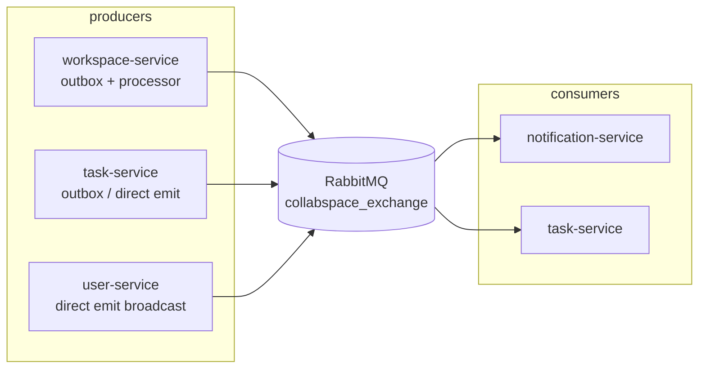
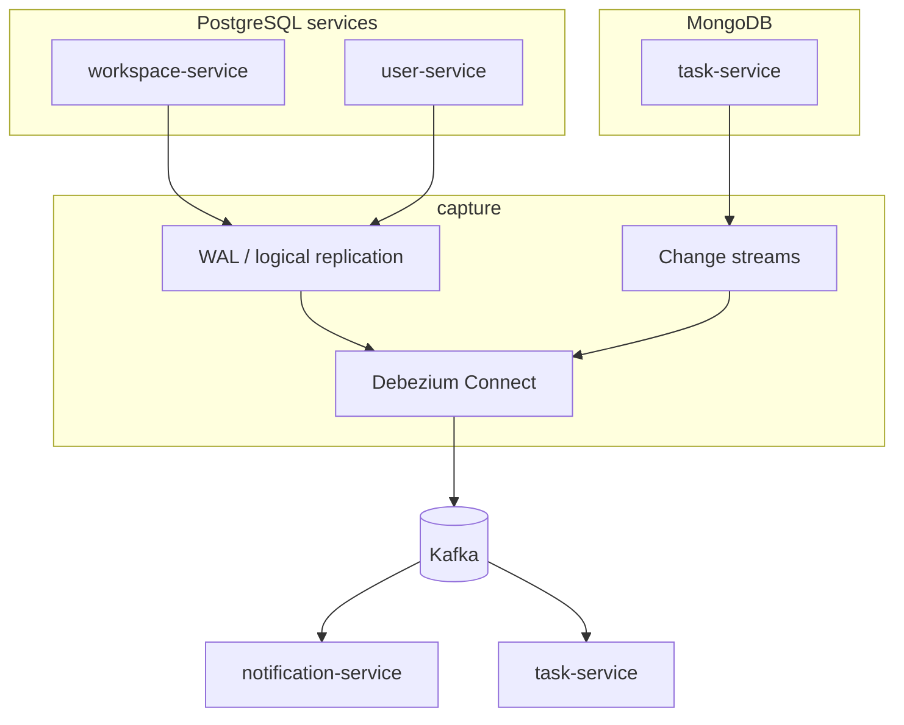

# Lộ trình migrate RabbitMQ → Kafka + CDC + Debezium

Tài liệu mô tả **từng phase nhỏ** để chuyển CollabSpace từ message bus **RabbitMQ** sang kiến trúc:

```text
Service (cùng transaction)
  → INSERT business row + INSERT outbox
  → WAL (Postgres) / Change Stream (Mongo)
  → Debezium
  → Kafka
  → Consumer services
```

**Mục tiêu học tập & kỹ thuật:**

- Học **Kafka** (topic, consumer group, retention, replay).
- Học **CDC** với **Debezium** (Postgres logical replication + Mongo change streams).
- Giữ **transactional outbox** — app không publish trực tiếp lên broker sau commit.
- **Không big-bang**: RabbitMQ vẫn là đường chính cho đến phase cuối; mỗi phase có rollback.

**Tài liệu liên quan:**

| Chủ đề | File |
|--------|------|
| Event contract hiện tại (RMQ) | [`.claude/docs/service-contracts.md`](../.claude/docs/service-contracts.md) → Event Contracts |
| Read model / replica | [cross-service-data.md](./cross-service-data.md), [`.claude/docs/read-models.md`](../.claude/docs/read-models.md) |
| Outbox trade-off | [trade-offs.md](./trade-offs.md) §5 |
| Resilience / idempotency | [`.claude/docs/resilience.md`](../.claude/docs/resilience.md) |
| Infra backlog | [team/phan-phu-tho-infrastructure-backlog.md](./team/phan-phu-tho-infrastructure-backlog.md) |
| Runbook RMQ (sẽ thay dần) | [runbooks/RabbitMQDLQNotEmpty.md](./runbooks/RabbitMQDLQNotEmpty.md) |

---

## 1. Hiện trạng vs mục tiêu

### 1.1 Kiến trúc hiện tại (RabbitMQ)



| Event (routing key) | Producer | Consumer |
|---------------------|----------|----------|
| `workspace_invited` | workspace-service (outbox → processor) | notification-service |
| `workspace_deleted` | workspace-service (outbox → processor) | notification-service, task-service |
| `task_assigned` | task-service (outbox → Debezium → Kafka khi `TASK_OUTBOX_PUBLISH_MODE=debezium`) | notification-service (Kafka) |
| `comment_created` | task-service (outbox → Debezium → Kafka) | notification-service (Kafka) |
| `comment_mentioned` | task-service (outbox → Debezium → Kafka) | notification-service (Kafka) |
| `user_registered` | user-service (broadcast 2 queue) | task-service, notification-service |
| `user_profile_updated` | user-service (broadcast 2 queue) | task-service, notification-service |

**auth-service:** có `auth_outbox_events` cho **email** (SMTP), không phải event bus microservice — **ngoài phạm vi** migrate này. Auth-service **không** dùng RabbitMQ nên Phase 6 (gỡ RMQ) không ảnh hưởng auth-service; outbox email + processor SMTP giữ nguyên.

### 1.2 Kiến trúc mục tiêu



**Nguyên tắc:**

1. **Chỉ CDC bảng/collection outbox** — không stream toàn bộ `user_profiles` / `tasks` nếu mục tiêu là domain event (tránh nhầm với “CDC sync read model thô”).
2. **Outbox Event Router** (Debezium SMT) map `event_type` → Kafka topic.
3. Consumer giữ **idempotency** theo `eventId` (đã có ở notification-service).
4. Payload domain **không đổi** — chỉ đổi transport và envelope wire format.

---

## 2. Tổng quan các phase

| Phase | Tên | Thời gian ước tính | Đụng luồng prod/demo? |
|-------|-----|--------------------|------------------------|
| **0** | Nền tảng Kafka + Debezium Connect | 0,5–1 ngày | Không |
| **0M** | Mongo replica set (dev) | 0,5 ngày | Có (local Mongo) — làm sớm nếu target Phase 5M |
| **1** | Quan sát CDC workspace outbox | 1 ngày | Không (dual path, RMQ vẫn chính) |
| **2** | Consumer Kafka pilot (dual-run) | 1–2 ngày | Không (idempotent dual) |
| **3** | Cutover workspace → chỉ Kafka | 1 ngày | Có (workspace events) |
| **4a** | User outbox + CDC `user_profile_updated` | 1–2 ngày | Có (một event) |
| **4b** | CDC `user_registered` + tắt RMQ user | 1 ngày | Có |
| **5M.0–5M.5** | Task Mongo outbox + Debezium Mongo | 3–5 ngày | Có (task events) |
| **6** | Gỡ RabbitMQ + dọn infra | 1–2 ngày | Có |
| **7** | Tùy chọn: Schema Registry, DLQ topic, replay | Sau 6 | Tùy |

```text
Phase 0 ──► Phase 1 ──► Phase 2 ──► Phase 3
                                      │
Phase 0M (song song)                  ▼
                               Phase 4a ──► 4b
                                      │
                                      ▼
                               Phase 5M.* ──► Phase 6 ──► Phase 7
```

**Gợi ý nhịp độ:** ~1 phase / tuần nếu làm part-time học tập.

---

## 3. Phase 0 — Nền tảng Kafka + Debezium Connect

### Mục tiêu

Có stack messaging mới chạy **song song** RabbitMQ; chưa đổi code NestJS.

### Việc làm

| # | Task | Ghi chú |
|---|------|---------|
| 0.1 | Thêm `infrastructure/docker/docker-compose.kafka.yml` | Kafka (KRaft single-node dev), Zookeeper **không** bắt buộc nếu dùng KRaft |
| 0.2 | Debezium Connect image trong cùng compose hoặc file riêng | REST `http://connect:8083` |
| 0.3 | (Tùy chọn) Kafka UI / AKHQ | Debug topic |
| 0.4 | Cập nhật `infrastructure/docker/.env.example` | `KAFKA_BROKERS`, `DEBEZIUM_CONNECT_URL` |
| 0.5 | Doc vận hành ngắn trong file này hoặc `infrastructure/kafka/README.md` | `docker compose -f ... up` |

### Postgres cho Debezium (chuẩn bị, chưa bắt connector)

Trên Postgres (dev), cần:

```sql
-- Kiểm tra
SHOW wal_level;  -- cần logical

-- Publication / slot do Debezium tạo khi register connector
```

Trong Compose có thể thêm `command: postgres -c wal_level=logical` cho service `postgres` **khi bắt đầu Phase 1** (đổi này có thể cần recreate volume dev).

### Definition of Done (DoD)

- [x] `docker compose` khởi động Kafka + Connect healthy — `infrastructure/docker/docker-compose.kafka.yml`
- [x] `GET /connectors` trả HTTP 200
- [x] Tạo thử topic `collabspace.test` và produce/consume được — `scripts/kafka-phase0-smoke.ps1` / `.sh`
- [ ] `scripts/demo-e2e.sh` / MVP local **vẫn pass** (chỉ RMQ) — verify sau khi `up` stack local

**Vận hành:** [infrastructure/kafka/README.md](../infrastructure/kafka/README.md)

### Rollback

Xóa compose profile Kafka; không ảnh hưởng app.

---

## 4. Phase 0M — Mongo replica set (dev)

### Mục tiêu

Debezium Mongo connector **bắt buộc replica set** (change streams). Compose hiện tại: `mongo:6` standalone (`docker-compose.db.yml`).

### Việc làm

| # | Task |
|---|------|
| 0M.1 | Đổi `mongo` service: `command: ["--replSet", "rs0", "--bind_ip_all"]` | ✅ `docker-compose.db.yml` + `mongo/docker-entrypoint-replset.sh` |
| 0M.2 | Script init `rs.initiate()` (entrypoint hoặc `scripts/init-mongo-rs.sh`) | ✅ `mongo-rs-init` sidecar + `scripts/init-mongo-rs.{sh,ps1}` |
| 0M.3 | Connection string task-service: `mongodb://...@mongo:27017/?replicaSet=rs0` | ✅ `.env.example` + Vault sync default |
| 0M.4 | Verify `rs.status()` OK; task-service migrate/seed vẫn chạy | ✅ `scripts/mongo-phase0m-smoke.ps1` / `.sh` |

### DoD

- [x] `mongosh --eval "rs.status().ok"` === 1
- [x] Mongo `withTransaction` commit OK (smoke script)
- [x] task-service + notification-service `/health/ready` === 200
- [x] `MONGO_URI` có `replicaSet=rs0` (`.env.example` + Vault sync)
- [x] Ghi chú prod K8s: [infrastructure/mongo/README.md](../../infrastructure/mongo/README.md)

### Lưu ý

Phase này **độc lập** Phase 0–3; có thể làm song song tuần 1. Bắt buộc trước **Phase 5M**.

---

## 5. Phase 1 — Quan sát CDC workspace outbox (Postgres WAL)

### Mục tiêu

Mỗi invite/delete workspace → message xuất hiện trên **Kafka**, trong khi **RMQ + WorkspaceOutboxProcessor vẫn chạy**.

### Bảng nguồn

- Database: `collabspace_workspace`
- Table: `workspace_outbox_events`
- Code: `services/workspace-service/src/infrastructure/outbox/`

Schema hiện tại (rút gọn): `id`, `event_type`, `payload` (jsonb), `processed_at`, `claimed_at`, …

Mapping outbox → routing key hiện tại:

| `event_type` (DB) | Routing key / domain |
|-------------------|----------------------|
| `workspace.workspace_invited` | `workspace_invited` |
| `workspace.workspace_deleted` | `workspace_deleted` |

### Việc làm

| # | Task |
|---|------|
| 1.1 | Bật `wal_level=logical` trên Postgres dev |
| 1.2 | Đăng ký Debezium Postgres connector: chỉ table `workspace_outbox_events` |
| 1.3 | Cấu hình **Outbox Event Router** SMT (relational) — map `event_type`, `payload`, `id` |
| 1.4 | Topic đích ví dụ: `collabspace.workspace.workspace_invited`, `collabspace.workspace.workspace_deleted` |
| 1.5 | **Không** tắt `WorkspaceOutboxProcessor` |

Ví dụ hướng cấu hình connector (chỉnh tên host/DB):

```json
{
  "name": "collabspace-workspace-outbox",
  "config": {
    "connector.class": "io.debezium.connector.postgresql.PostgresConnector",
    "database.hostname": "postgres",
    "database.port": "5432",
    "database.user": "postgres",
    "database.password": "postgres",
    "database.dbname": "collabspace_workspace",
    "topic.prefix": "collabspace.workspace",
    "table.include.list": "public.workspace_outbox_events",
    "transforms": "outbox",
    "transforms.outbox.type": "io.debezium.transforms.outbox.EventRouter",
    "transforms.outbox.table.field.event.id": "id",
    "transforms.outbox.table.field.event.type": "event_type",
    "transforms.outbox.table.field.event.payload": "payload",
    "transforms.outbox.route.topic.replacement": "collabspace.workspace.${routedByValue}"
  }
}
```

### Chuẩn hoá schema outbox (làm tại Phase 1, trước khi đăng ký connector)

Debezium Relational Outbox Event Router mặc định kỳ vọng các field:

```text
id | aggregate_type | aggregate_id | event_type | payload
```

`workspace_outbox_events` hiện thiếu `aggregate_type` và `aggregate_id`. Làm migration **ngay tại Phase 1** rồi dùng lại pattern cho user/task — tránh phải sửa connector config sau:

```sql
-- Migration: add aggregate columns to workspace_outbox_events
ALTER TABLE workspace_outbox_events
  ADD COLUMN IF NOT EXISTS aggregate_type VARCHAR(64) NOT NULL DEFAULT 'Workspace',
  ADD COLUMN IF NOT EXISTS aggregate_id   UUID;

-- Backfill từ payload (workspaceId)
UPDATE workspace_outbox_events
SET aggregate_id = (payload->>'workspaceId')::UUID
WHERE aggregate_id IS NULL;

ALTER TABLE workspace_outbox_events ALTER COLUMN aggregate_id SET NOT NULL;
```

> Nếu muốn dùng Option B (map field qua SMT config thay migration), cần test kỹ
> vì tài liệu Debezium về custom field mapping verbose và dễ lỗi — **Option A
> (migration) được khuyến nghị** để giảm rủi ro.

Cập nhật connector config sau khi migration:

```json
{
  "transforms.outbox.table.field.event.id":             "id",
  "transforms.outbox.table.field.event.type":           "event_type",
  "transforms.outbox.table.field.event.payload":        "payload",
  "transforms.outbox.table.field.event.key":            "aggregate_id",
  "transforms.outbox.route.topic.replacement":          "collabspace.workspace.${routedByValue}"
}
```

### DoD

- [x] Migration `aggregate_type` + `aggregate_id` — `1718000000004-AddWorkspaceOutboxAggregateFields.ts`
- [x] Debezium connector `collabspace-workspace-outbox` + `scripts/register-workspace-outbox-connector.ps1`
- [x] Insert outbox → message Kafka (`scripts/kafka-phase1-smoke.ps1`)
- [ ] Invite workspace qua API → Kafka (manual / demo-e2e)
- [x] `WorkspaceOutboxProcessor` + RMQ **không tắt**

### Rollback

Xóa connector; processor RMQ không đổi.

---

## 6. Phase 2 — Consumer Kafka pilot (dual-run)

### Mục tiêu

`notification-service` consume **`workspace_invited`** từ Kafka; RMQ listener **vẫn bật**; idempotency đảm bảo 1 notification.

### Việc làm

| # | Task | File gợi ý |
|---|------|------------|
| 2.1 | Thêm dependency `kafkajs` (hoặc Nest `Transport.KAFKA`) | `services/notification-service/package.json` |
| 2.2 | Module Kafka consumer + feature flag `KAFKA_CONSUMERS_ENABLED` | `src/infrastructure/messaging/kafka/` |
| 2.3 | Handler reuse `InboundNotificationEventMapper.toWorkspaceInvitedCommand` | mapper hiện có |
| 2.4 | Deserialize payload Debezium/outbox router (unwrap `payload` field) | helper mới, tham khảo `rmq-nest-envelope.ts` |
| 2.5 | Integration test: message mẫu → 1 notification | `*.spec.ts` |
| 2.6 | Env: `KAFKA_BROKERS`, `KAFKA_GROUP_ID=notification-service`, topic names | `.env.example` |

### Dual-run

```text
workspace invite
  → outbox INSERT
  → Debezium → Kafka → notification (Kafka consumer)  ─┐
  → processor → RMQ → notification (RMQ listener)       ─┴→ idempotent theo eventId → 1 row
```

### DoD

- [x] Kafka consumer `workspace_invited` + feature flag `KAFKA_CONSUMERS_ENABLED`
- [x] Reuse `InboundNotificationEventMapper` / idempotency `eventId`
- [x] Unit tests: parser + `WorkspaceInviteNotificationService`
- [ ] Dual-run manual: invite → 1 notification (RMQ + Kafka cùng bật) — chạy với stack đầy đủ
- [x] Log ghi rõ transport (`kafka` / `rmq`)

### Rollback

`KAFKA_CONSUMERS_ENABLED=false`.

---

## 7. Phase 3 — Cutover workspace events

### Mục tiêu

Workspace events **chỉ** qua Kafka; không còn publish RMQ từ workspace-service.

### Việc làm

| # | Task |
|---|------|
| 3.1 | Kafka consumer `workspace_deleted` → notification-service |
| 3.2 | Kafka consumer `workspace_deleted` → task-service (thay `workspace-delete-event-listener`) |
| 3.3 | Feature flag `WORKSPACE_OUTBOX_PUBLISH_MODE=debezium` — skip RMQ trong `WorkspaceOutboxProcessor` hoặc disable processor |
| 3.4 | (Tùy chọn) Dọn cột `claimed_at` / `processed_at` trên outbox — **chỉ sau** ổn định; có thể giữ để audit |
| 3.5 | Cập nhật `.claude/docs/service-contracts.md` — ghi Kafka topic song song RMQ |

### DoD

- [x] Kafka consumer `workspace_invited` + `workspace_deleted` (notification-service)
- [x] Kafka consumer `workspace_deleted` (task-service)
- [x] `WORKSPACE_OUTBOX_PUBLISH_MODE=debezium` skips RMQ processor
- [x] Invite + delete workspace E2E pass (local Kafka stack) — `scripts/kafka-phase3-e2e.ps1` / `.sh`
- [ ] Không còn message mới trên RMQ routing keys workspace (prod deploy)
- [ ] `demo-e2e.sh` pass (MVP qua Traefik; stack Kafka cutover local đã verify riêng)

### Rollback

Bật lại processor RMQ; tắt Kafka consumer workspace.

---

## 8. Phase 4 — User-service: outbox Postgres + CDC

### Hiện trạng (sau 4a + 4b code)

`user-service` có **`user_outbox_events`** + `UserOutboxService`; use case ghi outbox cùng TX với profile. Local Kafka cutover: `USER_OUTBOX_PUBLISH_MODE=debezium` (skip RMQ sau commit). `RabbitMqEventsService` vẫn trong code cho dual-run / prod rollback (`rabbitmq` mode).

File: `services/user-service/src/infrastructure/outbox/`, `services/user-service/src/infrastructure/messaging/rabbitmq/rabbitmq-events.service.ts`

### Lưu ý transaction — TypeORM queryRunner (bắt buộc đọc trước 4a)

`user-service` theo hexagonal; use case không được gọi trực tiếp TypeORM. Pattern chuẩn:

```ts
// application/use-cases/update-user-profile.use-case.ts
async execute(cmd: UpdateUserProfileCommand): Promise<void> {
  await this.unitOfWork.run(async (qr) => {
    // 1. update profile qua repository port (nhận queryRunner)
    await this.userProfileRepo.updateWithRunner(qr, profile);
    // 2. insert outbox cùng transaction
    await this.outboxRepo.insertWithRunner(qr, {
      aggregateType: 'User',
      aggregateId:   profile.userId,
      eventType:     'user_profile_updated',
      payload:       /* domain event payload */,
    });
  });
  // RabbitMqEventsService.broadcast() giữ nguyên (dual-run phase 4a)
}
```

Cần thêm (đã có trong repo):
- `IUnitOfWork` port trong `domain/ports/`
- `TypeOrmUnitOfWork` adapter trong `infrastructure/`
- Repository ports nhận `queryRunner` tuỳ chọn

### Phase 4a — `user_profile_updated`

| # | Task |
|---|------|
| 4a.1 | Migration `user_outbox_events` — **dùng schema chuẩn** (`aggregate_type`, `aggregate_id`, `event_type`, `payload`, `occurred_at`) — tham khảo pattern đã làm ở Phase 1 | ✅ |
| 4a.2 | Thêm `IUnitOfWork` port + `TypeOrmUnitOfWork` adapter | ✅ |
| 4a.3 | `UpdateUserProfileUseCase`: **cùng transaction** UPDATE profile + INSERT outbox (xem pattern trên) | ✅ |
| 4a.4 | Debezium connector DB `collabspace_user`, table `user_outbox_events` | ✅ `scripts/register-user-outbox-connector.ps1` |
| 4a.5 | Kafka consumers task + notification (dual-run, RMQ vẫn bật) | ✅ |
| 4a.6 | Test đổi tên → `user_replicas` sync | ✅ `scripts/kafka-phase4-e2e.ps1` |

### Phase 4b — `user_registered`

| # | Task |
|---|------|
| 4b.1 | `CreatePendingUserProfileUseCase`: TX + INSERT outbox `user_registered` (cùng pattern 4a) | ✅ |
| 4b.2 | Consumers dual-run cho `user_registered` | ✅ |
| 4b.3 | Tắt `RabbitMqEventsService` / xóa RMQ client factory sau khi dual-run ổn định | ⏳ local `debezium` mode; xóa RMQ module ở Phase 6 |
| 4b.4 | Verify fallback hydrate HTTP khi replica race (`.claude/docs/read-models.md`) | ✅ E2E đợi replica trước invite (Phase 3 script) |

### DoD (cả 4a + 4b)

- [x] Local cutover: `USER_OUTBOX_PUBLISH_MODE=debezium` — không RMQ publish user events (verified E2E)
- [x] `user_registered` + `user_profile_updated` → `user_replicas` sync — `scripts/kafka-phase4-e2e.ps1`
- [x] Replica lag metric `user_replica_sync_lag_seconds` vẫn ghi từ Kafka consumer
- [x] `occurredAt` trong payload giữ nguyên contract
- [ ] Prod deploy: không message mới trên RMQ user routing keys

---

## 9. Phase 5M — Task-service (Mongo outbox + Debezium)

### Hiện trạng (sau Phase 5M cutover local)

| Luồng | Outbox? | Ghi chú |
|-------|---------|---------|
| Task assign | Có (`task_outbox_events`) | `AssignTaskHandler` + `MongoUnitOfWork` — cùng TX với save task |
| Comment / mention | Có | `CreateCommentHandler` — comment + activity + outbox cùng TX |
| Publish path | Debezium CDC | `TASK_OUTBOX_PUBLISH_MODE=debezium` — processor skip RMQ |

Collection: `services/task-service/src/infrastructure/outbox/task-outbox.schema.ts`

### Phase 5M.0 — Prerequisites

- [x] Phase 0M (Mongo RS) xong — **bắt buộc**, `withTransaction` Mongo không chạy được trên standalone
- [x] Phase 0 (Kafka + Connect) xong
- [x] Mongo driver >= 4 (mongoose ≥ 7 / `mongodb` ≥ 5)

### Phase 5M.1 — Đưa `task_assigned` vào outbox

| # | Task |
|---|------|
| 5M.1.1 | `AssignTaskHandler`: sau `saveAsync`, **enqueue outbox** thay vì `rabbitMqEvents.publishTaskAssigned` |
| 5M.1.2 | Dùng Mongo `withTransaction` để gộp save task + INSERT outbox trong 1 session — **yêu cầu Phase 0M hoàn thành trước** |
| 5M.1.3 | Pattern tham khảo: `session.withTransaction(async () => { await taskRepo.save(task, { session }); await outboxRepo.insert(event, { session }); })` |
| 5M.1.4 | Unit test handler |

### Phase 5M.2 — Transaction cho comment/mention

| # | Task |
|---|------|
| 5M.2.1 | `TaskCommentNotificationPublisher` + repository: session transaction ghi comment + outbox |
| 5M.2.2 | Review `insertMany` mention batch — cùng session |

### Phase 5M.3 — Debezium Mongo connector

| # | Task |
|---|------|
| 5M.3.1 | Connector: database `collabspace_task`, collection `task_outbox_events` |
| 5M.3.2 | **MongoDB Outbox Event Router** SMT (`MongoEventRouter`) |
| 5M.3.3 | Predicate: chỉ transform event từ outbox collection |
| 5M.3.4 | Topic ví dụ: `collabspace.task.task_assigned`, `collabspace.task.comment_created`, … |

Tài liệu Debezium: [MongoDB connector](https://debezium.io/documentation/reference/stable/connectors/mongodb.html), [MongoDB Outbox Event Router](https://debezium.io/documentation/reference/stable/transformations/mongodb-outbox-event-router.html).

### Phase 5M.4 — Kafka consumers

| # | Task |
|---|------|
| 5M.4.1 | notification-service: `task_assigned`, `comment_created`, `comment_mentioned` |
| 5M.4.2 | Dual-run với RMQ |
| 5M.4.3 | E2E assign + comment + mention |

### Phase 5M.5 — Cutover task

| # | Task |
|---|------|
| 5M.5.1 | Tắt `TaskOutboxProcessor` publish RMQ |
| 5M.5.2 | Tắt `RabbitMqEventsService` / RMQ module task-service |
| 5M.5.3 | Tắt RMQ microservice listener task-service (`user-event`, `workspace_deleted` đã chuyển Kafka ở phase trước) |

### DoD

- [x] `AssignTaskHandler` → outbox + Mongo transaction (`MongoUnitOfWork`)
- [x] `CreateCommentHandler` → comment + activity + outbox cùng transaction
- [x] Debezium connector `collabspace-task-outbox` + `scripts/register-task-outbox-connector.ps1`
- [x] notification-service Kafka consumer `task-events-kafka.consumer.ts`
- [x] `TASK_OUTBOX_PUBLISH_MODE=debezium` skips RMQ processor
- [x] Dual-run / E2E manual: `scripts/kafka-phase5-e2e.ps1` pass (stack đầy đủ) — 2026-06-20
- [x] `demo-e2e` pass (Traefik + Kafka cutover local) — 2026-06-20

---

## 10. Phase 6 — Gỡ RabbitMQ

### Mục tiêu

Stack chạy **không** RabbitMQ container; docs/CI/Helm đồng bộ.

### Việc làm

| # | Task |
|---|------|
| 6.1 | Xóa `Transport.RMQ` từ `main.ts` các service |
| 6.2 | Xóa listener controllers `*event-listener*` phụ thuộc RMQ (hoặc archive) |
| 6.3 | Xóa `infrastructure/rabbitmq/`, `rabbitmq-statefulset.yaml`, Helm rabbitmq chart deps |
| 6.4 | Vault/ESO: `KAFKA_*` thay `RABBITMQ_*`; cập nhật `values.yaml`, `configmap-shared.yaml` |
| 6.5 | Xóa `reconcile-rabbitmq-queues.sh`, `wipe-rabbitmq-volume.sh` hoặc chuyển archive |
| 6.6 | Runbooks mới: consumer lag, DLQ topic, connector down |
| 6.7 | Prometheus alerts: thay `RabbitMQHighQueueDepth` bằng Kafka consumer lag |
| 6.8 | Cập nhật `service-contracts.md`, `project-architecture.md`, `CLAUDE.md`, skills nếu cần |

### auth-service

Giữ outbox email + processor SMTP — **không** bắt buộc Kafka.

### DoD

- [x] `docker compose up` không cần `rabbitmq` service — 2026-06-20
- [ ] CI lint/build/test pass
- [x] `demo-e2e` pass (Kafka stack, Phase 5M gate)
- [x] Không còn reference `RABBITMQ_URL` bắt buộc trong app services

---

## 11. Phase 7 — Tùy chọn (sau khi ổn định)

| Hạng mục | Lợi ích |
|----------|---------|
| **Schema Registry** (Avro/JSON Schema) | Contract versioned cho event |
| **Dead-letter topic** + retry consumer | Thay DLQ queue RMQ |
| **Replay** từ Kafka offset | Test consumer mới, debug |
| **CDC read model thô** (không outbox) | Học thêm: Debezium `user_profiles` → topic riêng (so sánh với outbox) |
| **Kafka Connect sink** | Export sang analytics |
| **Prod HA** | Kafka multi-broker, Connect distributed, Postgres replication slot monitoring |

---

## 12. Mapping topic Kafka (đề xuất)

**Convention tên topic:** `collabspace.<domain>.<event>` — domain là service aggregate (`workspace`, `user`, `task`), event là snake_case ngắn gọn **không lặp tên domain**.

| Domain event | Topic | Partition key | Consumer group |
|--------------|-------|---------------|----------------|
| `workspace_invited` | `collabspace.workspace.invited` | `workspaceId` | `notification-service` |
| `workspace_deleted` | `collabspace.workspace.deleted` | `workspaceId` | `notification-service`, `task-service` |
| `user_registered` | `collabspace.user.registered` | `userId` | `task-service`, `notification-service` |
| `user_profile_updated` | `collabspace.user.profile_updated` | `userId` | `task-service`, `notification-service` |
| `task_assigned` | `collabspace.task.assigned` | `taskId` | `notification-service` |
| `comment_created` | `collabspace.task.comment_created` | `taskId` | `notification-service` |
| `comment_mentioned` | `collabspace.task.comment_mentioned` | `taskId` | `notification-service` |

**Lưu ý:**
- Chốt tên topic tại **Phase 1** trước khi đăng ký connector. Sau cutover, đổi topic name cần migrate consumer group — tốn công.
- Ghi **topic thật** vào `service-contracts.md` khi connector được đăng ký lần đầu.
- `route.topic.replacement` trong connector config phải khớp chính xác với tên trên.

---

## 13. Chuẩn hóa schema outbox — tóm tắt

> Chi tiết migration SQL và connector config đã được ghi trong **Phase 1** (mục 5) — xem "Chuẩn hoá schema outbox" tại đó.

Schema chuẩn áp dụng cho tất cả outbox tables/collections:

```text
id | aggregate_type | aggregate_id | event_type | payload | occurred_at
```

| Service | Table / Collection | Trạng thái |
|---------|-------------------|-----------|
| workspace-service | `workspace_outbox_events` | ✅ `aggregate_type`, `aggregate_id` (Phase 1) |
| user-service | `user_outbox_events` | ✅ schema chuẩn (Phase 4a) |
| task-service | `task_outbox_events` (Mongo) | ✅ `aggregateType`, `aggregateId` + MongoEventRouter (Phase 5M) |

Làm **một lần** ở Phase 1 (workspace) → copy pattern sang user/task để tránh điều chỉnh connector config sau.

---

## 14. Environment variables (tổng hợp)

### Connect / Infra

```env
KAFKA_BROKERS=kafka:9092
DEBEZIUM_CONNECT_URL=http://debezium-connect:8083
```

### Postgres (Phase 1+)

```env
# postgres container
POSTGRES_INITDB_ARGS hoặc command: wal_level=logical
```

### Producers (sau cutover — không cần broker URL trong app)

App **không** cần `KAFKA_BROKERS` nếu chỉ INSERT outbox; Debezium là publisher.

### Consumers

```env
KAFKA_BROKERS=kafka:9092
KAFKA_CONSUMERS_ENABLED=true
KAFKA_GROUP_ID=notification-service   # base id; xem consumer groups thật bên dưới
KAFKA_TOPIC_WORKSPACE_INVITED=collabspace.workspace.workspace_invited
KAFKA_TOPIC_WORKSPACE_DELETED=collabspace.workspace.workspace_deleted
KAFKA_TOPIC_USER_REGISTERED=collabspace.user.registered
KAFKA_TOPIC_USER_PROFILE_UPDATED=collabspace.user.profile_updated
# ... task topics (Phase 5M+)
```

**Consumer groups (bắt buộc tách):** mỗi service có thể chạy **nhiều** `kafkajs` consumer (user events vs workspace events). **Không** dùng chung một `groupId` — Kafka chia partition giữa members và consumer sẽ miss topic. Code dùng suffix:

| Consumer class | Effective group id |
|----------------|-------------------|
| `*UserEventsKafkaConsumer` | `${KAFKA_GROUP_ID}-user-events` |
| `*WorkspaceEventsKafkaConsumer` / `WorkspaceDeletedKafkaConsumer` | `${KAFKA_GROUP_ID}-workspace-events` |

Ví dụ `notification-service`: `notification-service-user-events`, `notification-service-workspace-events`.

### Feature flags migrate

```env
WORKSPACE_OUTBOX_PUBLISH_MODE=debezium   # debizium | rabbitmq | dual
TASK_OUTBOX_PUBLISH_MODE=debezium
KAFKA_DUAL_CONSUME=true                  # Phase 2–4 dual-run
```

---

## 15. File / module cần đụng (checklist)

### Infrastructure

- `infrastructure/docker/docker-compose.kafka.yml` (mới)
- `infrastructure/docker/docker-compose.db.yml` (wal_level, mongo RS)
- `infrastructure/kafka/` — connector JSON, README (mới)
- `infrastructure/helm/collabspace/` — Kafka StatefulSet hoặc Strimzi (prod)
- Xóa dần: `infrastructure/rabbitmq/`, `infrastructure/k8s/rabbitmq-statefulset.yaml`

### Shared

- `packages/shared/src/messaging/` — có thể thêm `kafka-envelope.ts`, abstraction `EventTransport`

### workspace-service

- `infrastructure/outbox/workspace-outbox.processor.ts` — tắt RMQ publish
- Migrations outbox schema (nếu thêm `aggregate_id`)

### user-service

- Migration `user_outbox_events`
- Use cases: `create-pending-user-profile`, `update-user-profile`
- Xóa `rabbitmq-events.service.ts`

### task-service

- `assign-task.handler.ts` — outbox thay RMQ
- `task-comment-notification.publisher.ts` — transactions
- `infrastructure/outbox/task-outbox.processor.ts` — tắt RMQ
- `main.ts` — bỏ RMQ microservice

### notification-service

- Kafka consumers thay `presentation/controllers/internal/*event-listener*.ts`
- `rmq-notification-consumer.helper.ts` → generic idempotent consumer

### Docs / CI

- `.claude/docs/service-contracts.md`
- `docs/features.md` (nếu ghi messaging stack)
- `scripts/demo-e2e.sh`

---

## 16. Kiểm tra mỗi phase (template)

```text
[ ] docker compose / k8s stack healthy
[ ] Migration DB (nếu có) chạy trên dev
[ ] Unit tests service liên quan pass
[ ] pnpm run test (root) pass
[ ] Manual: trigger event → thấy message Kafka
[ ] Manual: consumer xử lý đúng
[ ] demo-e2e.sh pass
[ ] Rollback flag đã thử
[ ] Doc/env.example cập nhật
```

---

## 17. Rủi ro & giảm thiểu

| Rủi ro | Giảm thiểu |
|--------|------------|
| Dual consumer tạo duplicate | Idempotency `eventId` (bắt buộc Phase 2) |
| Hai Kafka consumer cùng `groupId` trong một process | Tách `${KAFKA_GROUP_ID}-user-events` vs `-workspace-events` (Phase 3 E2E verify) |
| Debezium slot lag / disk WAL | Monitor replication slot; retention Postgres |
| Mongo standalone không CDC | Phase 0M bắt buộc |
| Connector down → event kẹt trong outbox | Outbox row vẫn trong DB; replay khi Connect lên; alert lag |
| Schema outbox không khớp SMT | Pilot workspace Phase 1 trước |
| Prod cutover | Blue/green: dual-run ít nhất 1 sprint trên staging |
| assign task không cùng TX | Phase 5M.1 fix trước Debezium — ✅ Done |
| Mongo Debezium payload là JSON string (double-encoded) | Consumer `parseKafkaOutboxJsonValue` parse 2 lần (Phase 5M E2E) |

---

## 18. So sánh nhanh: Postgres WAL vs Mongo Change Streams

| | Postgres (workspace, user) | Mongo (task) |
|--|---------------------------|--------------|
| Cơ chế | WAL logical decoding | Change streams trên oplog |
| Yêu cầu | `wal_level=logical`, replication slot | **Replica set** |
| Outbox SMT | Relational EventRouter | MongoEventRouter |
| Transaction | SQL `BEGIN … COMMIT` | `session.withTransaction()` |
| CollabSpace readiness | workspace outbox ✅ | comment outbox ✅; assign ❌ |

---

## 19. Lịch sử / ghi chú repo

- Runtime từng có Kafka dead code ở `notification-service` (`kafka-node`) — đã xóa (xem `docs/team/application-backlog.md`). Migrate mới dùng `kafkajs` hoặc Nest Kafka transport.
- RabbitMQ hiện có DLX + reconcile script: `infrastructure/deploy/reconcile-rabbitmq-queues.sh` — tham khảo semantics khi thiết kế DLQ topic Kafka.

---

## 20. Changelog tài liệu

| Ngày | Thay đổi |
|------|----------|
| 2026-06-19 | Khởi tạo lộ trình Phase 0 → 7 |
| 2026-06-19 | Phase 0: `docker-compose.kafka.yml`, `infrastructure/kafka/README.md`, smoke scripts |
| 2026-06-19 | Phase 1: wal_level logical, outbox aggregate columns, Debezium workspace connector |
| 2026-06-19 | Phase 2: notification-service Kafka consumer `workspace_invited` (dual-run RMQ) |
| 2026-06-20 | Phase 5M: task outbox aggregate fields, Mongo UoW, Debezium Mongo connector, notification Kafka task consumer, `kafka-phase5-e2e.ps1` |
| 2026-06-20 | Phase 5M E2E green: `kafka-phase5-e2e.ps1` (mention → assign → `COMMENT_ADDED`); Mongo payload double-parse fix |
| 2026-06-20 | Phase 6: remove RabbitMQ from services, Docker Compose, Helm/K8s, Vault; Kafka-only event bus |
| 2026-06-19 | Phase 0M: Mongo replica set `rs0` local (`docker-compose.db.yml`, `mongo-rs-init`, `scripts/init-mongo-rs`) |
| 2026-06-20 | Phase 3/4 local E2E: `kafka-phase3-e2e`, `kafka-phase4-e2e`; consumer group suffix fix; `docker-local-up.ps1` |
