# CollabSpace — Nội dung báo cáo thuyết trình

> Tài liệu này tổng hợp nội dung chi tiết cho từng slide, bao gồm ý bullet, sơ đồ Mermaid, và nguồn dữ liệu từ codebase.  
> Cập nhật: 2026-06-25

---

## Slide 1 — Tổng quan đề tài

### Giới thiệu

- **Tên đề tài:** CollabSpace — Nền tảng quản lý cộng tác nhóm
- **Mô tả ngắn:** Mini Notion + Slack + Jira — hệ thống cho phép người dùng đăng ký tài khoản, tạo workspace, mời thành viên, quản lý project/task, comment có `@mention`, và nhận thông báo thời gian thực
- **Mục tiêu học thuật:** Xây dựng một hệ thống microservices đầy đủ từ thiết kế đến triển khai production-like trên cloud

### Phạm vi hệ thống

- **7 backend services:** auth, user, workspace, task, notification, dlq, analytics
- **1 API Gateway:** Traefik
- **Event bus:** Kafka + Debezium CDC
- **Frontend SPA:** Vite + React (repo riêng: `collabspace-fe`)
- **Hạ tầng:** DigitalOcean Kubernetes (DOKS) + Helm + HashiCorp Vault

### Điểm nổi bật

- Áp dụng đầy đủ 5 kiến trúc mẫu: Clean/Hexagonal, CQRS + Event Sourcing, Transactional Outbox, Saga, Dead Letter Queue
- Triển khai thực tế lên DOKS với CI/CD pipeline (GitHub Actions → Container Registry → Helm)
- Observability đủ 3 trụ cột: Metrics (Prometheus + Grafana) · Logs (Loki) · Traces (OpenTelemetry + Jaeger)
- **Database HA đầy đủ 3 lớp**: PostgreSQL (CloudNativePG), MongoDB (Replica Set), Redis (Sentinel) — tất cả đều tự động failover, đã drill kiểm chứng
- Backup tự động hàng ngày lên cloud storage, restore drill đã kiểm chứng

---

## Slide 2 — Danh sách thành viên & Phân công công việc

### Thành viên

| STT | Họ tên | MSSV | Vai trò chính |
|-----|--------|------|---------------|
| 1 | Lê Ngọc Anh | ... | Auth/User service + DOKS deploy |
| 2 | ... | ... | Workspace/Task service |
| 3 | Phan Phú Thọ | ... | Infrastructure / DevOps |
| 4 | ... | ... | Frontend + Notification |

> ⚠️ Điền MSSV và vai trò thực tế của nhóm vào đây.

### Phân công theo domain

| Domain | Thành viên |
|--------|------------|
| Auth & Identity | ... |
| User Directory | ... |
| Workspace & Project | ... |
| Task & Comment | ... |
| Notification | ... |
| DLQ & Analytics | ... |
| Infrastructure / K8s / CI/CD | Phan Phú Thọ |
| Frontend SPA | ... |

---

## Slide 3 — Bối cảnh & Đặt vấn đề

### Bối cảnh

- Làm việc nhóm hiện đại cần nhiều công cụ: chat, task management, notification — thường phân tán ở nhiều app khác nhau
- Các nền tảng như Notion, Jira, Slack giải quyết tốt nhưng không thể học được kiến trúc bên trong
- Nhu cầu thực tế: xây dựng một hệ thống tương tự để **hiểu sâu kiến trúc phân tán**

### Vấn đề với kiến trúc Monolith

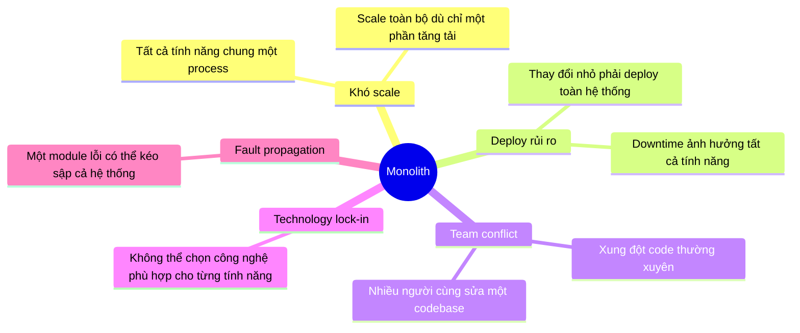

### Tại sao chọn Microservices?

| Vấn đề | Giải pháp Microservices |
|--------|------------------------|
| Scale từng phần | Mỗi service scale độc lập theo nhu cầu thực tế |
| Team phân công | Mỗi service là một bounded context riêng biệt |
| Fault isolation | Một service lỗi không kéo sập toàn hệ thống |
| Technology fit | Chọn đúng loại database cho từng bài toán |
| Học thực tế | Trải nghiệm event bus, saga, DLQ, observability thật sự |

### Trade-off chấp nhận

- Vận hành phức tạp hơn monolith — nhiều service cần monitor
- Debug xuyên service khó hơn — cần công cụ tracing, log tập trung
- Không thể truy vấn dữ liệu trực tiếp giữa các service — phải dùng event sync
- Một số luồng chấp nhận dữ liệu không nhất quán tức thì (eventual consistency)

> 📄 Nguồn: `docs/trade-offs.md` §1, §2

---

## Slide 4 — Đặc tả yêu cầu hệ thống

### Yêu cầu chức năng

#### Auth & Identity
- Đăng ký tài khoản → xác thực email bằng mã OTP
- Đăng nhập / đăng xuất / làm mới phiên đăng nhập
- Quên mật khẩu / đặt lại mật khẩu
- Đổi mật khẩu — tự động thu hồi tất cả phiên cũ
- Quản lý phiên đăng nhập: xem danh sách, thu hồi từng phiên

#### Workspace & Project
- Tạo / xem / cập nhật workspace
- Mời thành viên tham gia workspace
- Chấp nhận / từ chối lời mời
- Phân quyền thành viên: chủ sở hữu / quản lý / thành viên
- Tạo / cập nhật / xóa project trong workspace

#### Task & Comment
- Tạo task với đầy đủ thông tin: tiêu đề, mô tả, mức độ ưu tiên, hạn chót, nhãn
- Xem board theo trạng thái: Chưa làm / Đang làm / Hoàn thành
- Gán người thực hiện, đổi trạng thái, xóa task
- Upload / xóa tệp đính kèm
- Comment trên task, sửa / xóa comment
- Nhắc mention người dùng bằng @tên → gửi thông báo tự động

#### Notification
- Nhận thông báo khi: được mời workspace, được giao task, được nhắc mention trong comment
- Xem danh sách thông báo, đánh dấu đã đọc, đánh dấu tất cả đã đọc
- Cập nhật badge thông báo realtime không cần tải lại trang — dùng **Server-Sent Events (SSE)** thay vì WebSocket

> **Cơ chế SSE:** client mở một kết nối HTTP dài hạn đến server, server đẩy tín hiệu xuống mỗi khi có thông báo mới. Client nhận tín hiệu → gọi lại API để lấy danh sách mới nhất. Đơn giản hơn WebSocket (chỉ server→client), không cần thư viện socket phức tạp, đủ dùng cho bài toán notification badge.

### Yêu cầu phi chức năng

| Thuộc tính | Mục tiêu | Trạng thái |
|------------|----------|------------|
| **Health check** | Phân biệt process sống và sẵn sàng nhận request | ✅ |
| **Timeout nội bộ** | Mọi giao tiếp giữa service không treo quá 3 giây | ✅ |
| **Idempotency** | Gửi trùng request không tạo dữ liệu trùng | ✅ |
| **At-least-once** | Event không bị mất, consumer xử lý trùng được | ✅ |
| **Degradation** | Service phụ thuộc lỗi → trả lỗi rõ ràng, không crash | ✅ |
| **Observability** | Metrics, logs tập trung, cảnh báo tự động | ✅ |
| **Security** | Xác thực nhiều lớp, phân quyền, bảo vệ nội bộ | ✅ |
| **Scalability** | Scale ngang từng service theo tải | ⚠️ Cấu hình có, chưa đo baseline |
| **SLO latency** | Cam kết thời gian phản hồi theo từng route | ⚠️ Đo được, chưa cam kết con số |
| **Audit compliance** | Ghi log mọi thao tác admin | ❌ Ngoài phạm vi MVP |

### Ngoài phạm vi MVP

- Sprint, epic, backlog planning
- Subtask, dependency giữa task
- Realtime WebSocket hai chiều (hiện tại dùng SSE một chiều cho notification badge)
- Time tracking, automation rules
- Multi-region HA

> 📄 Nguồn: `docs/features.md`, `docs/nfrs.md`

---

## Slide 5 — Công nghệ & Kiến trúc mẫu

### Stack công nghệ

| Tầng | Công nghệ |
|------|-----------|
| **Framework** | NestJS 11 + TypeScript |
| **Database** | PostgreSQL (auth, user, workspace), MongoDB (task, notification, dlq, analytics) |
| **Cache / HA** | Redis Sentinel (1 master + 2 replicas + 3 sentinel sidecars) |
| **RPC nội bộ** | gRPC (xác thực token, giao tiếp auth ↔ user, auth ← tất cả services) |
| **Event bus** | Apache Kafka + Debezium Connect |
| **Gateway** | Traefik |
| **Container / Orchestration** | Docker Compose (dev) · Kubernetes DOKS (prod) |
| **CI/CD** | GitHub Actions → Container Registry → Helm |
| **Secrets** | HashiCorp Vault + External Secrets Operator |
| **Observability** | Prometheus · Grafana · Loki · Promtail · k6 · OpenTelemetry + Jaeger |
| **Frontend** | Vite + React |

### Kiến trúc mẫu áp dụng

#### 1. Clean / Hexagonal Architecture

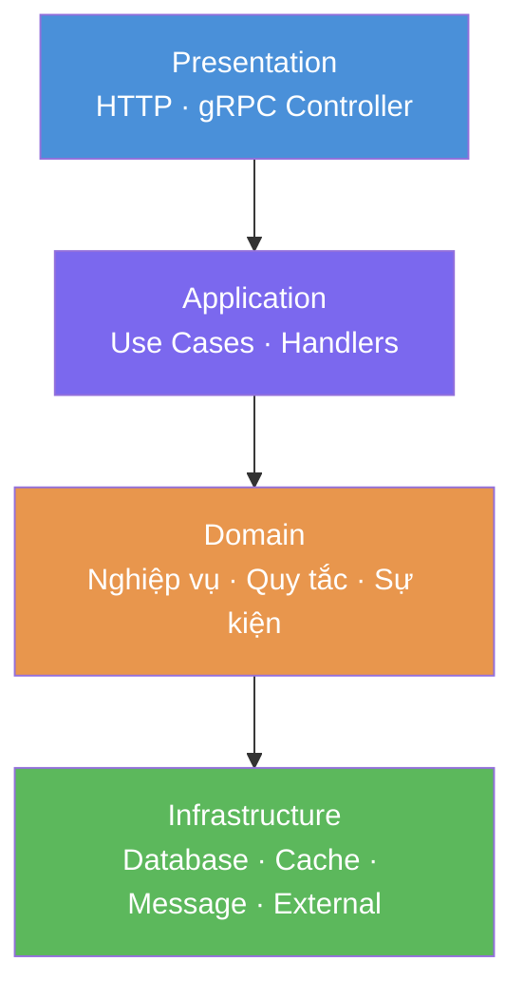

- Áp dụng: auth, user, workspace service
- Lợi ích: nghiệp vụ tách hoàn toàn khỏi hạ tầng — dễ test, dễ thay DB hay framework mà không ảnh hưởng logic

#### 2. CQRS + Event Sourcing

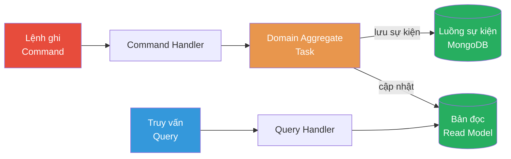

- Áp dụng: task service
- Lợi ích: lưu toàn bộ lịch sử thay đổi của task, có thể dựng lại trạng thái bất kỳ thời điểm nào

**Ví dụ thực tế — Activity Feed từ Event Sourcing:**

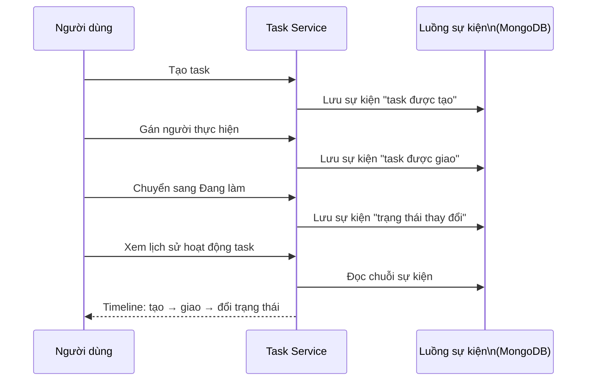

Workspace cũng có activity feed riêng — timeline mời thành viên, tạo project, chấp nhận/từ chối lời mời. Dữ liệu không cần lưu riêng — đọc thẳng từ chuỗi sự kiện đã có.

#### 3. Transactional Outbox Pattern

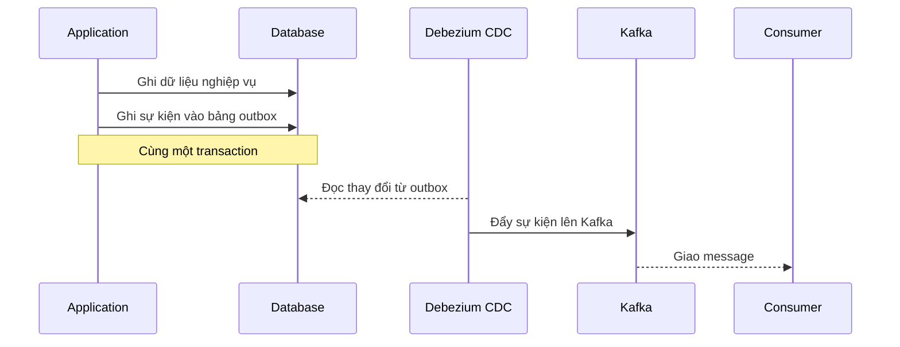

- Áp dụng: workspace, task service (sự kiện domain) · auth service (email OTP)
- Lợi ích: sự kiện không bao giờ bị mất dù Kafka tạm thời down — vì sự kiện và dữ liệu được ghi trong cùng một transaction DB

> **Biến thể thú vị — Email OTP dùng Graphile Worker:**  
> Auth service không dùng Kafka hay Redis queue để gửi email. Thay vào đó, email OTP được ghi vào một bảng job trong **cùng PostgreSQL transaction** với đăng ký tài khoản. **Graphile Worker** — job queue chạy trên PostgreSQL — poll bảng đó và gửi email qua SMTP async. Không cần broker riêng, không bao giờ mất job dù app restart, và toàn bộ nằm trong một DB đã có sẵn.

#### 4. Saga Pattern (Compensating Transaction)

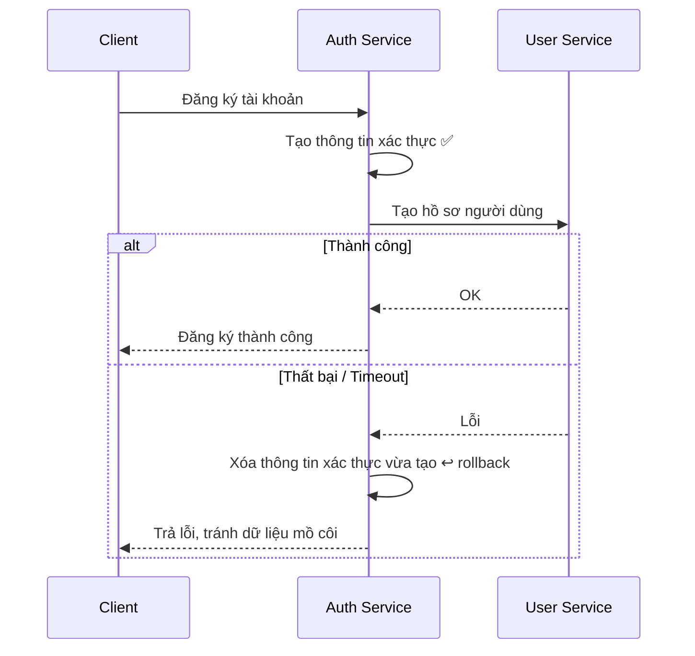

- Áp dụng: luồng đăng ký trong auth service
- Lợi ích: tránh tình huống có tài khoản đăng nhập nhưng không có hồ sơ người dùng

#### 5. Dead Letter Queue (DLQ)

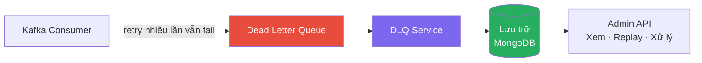

- Áp dụng: toàn bộ hệ thống — message lỗi không bị bỏ rơi mà được lưu lại để điều tra

> 📄 Nguồn: `docs/trade-offs.md`, `.claude/docs/service-architecture.md`

---

## Slide 6 — Kiến trúc hệ thống

### Sơ đồ tổng thể

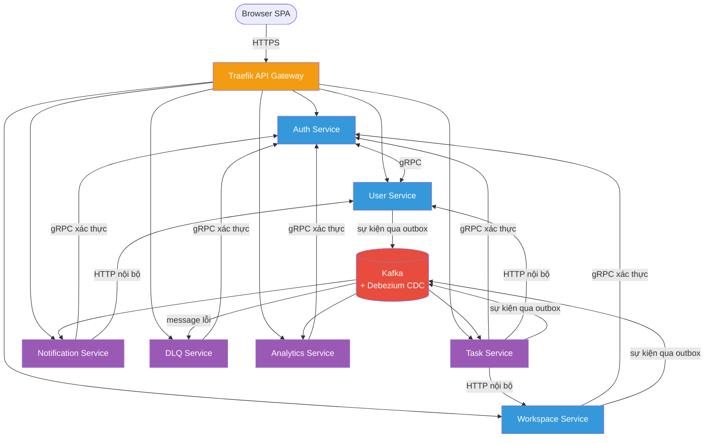

### Quyết định thiết kế trong sơ đồ

> Mỗi thành phần trong sơ đồ trên là một quyết định chủ động — không phải mặc định.

**Tại sao một API Gateway duy nhất (Traefik)?**
Thay vì để client gọi thẳng vào từng service, tất cả đi qua một điểm duy nhất. Điều này cho phép xác thực token, chặn header giả mạo (`X-User-Id`), và áp dụng rate limit tập trung — các service không cần tự lo. Traefik được chọn vì hỗ trợ Kubernetes IngressRoute native, ACME TLS tự động, và cấu hình dynamic không cần reload.

**Tại sao gRPC cho xác thực token thay vì REST?**
Xác thực token xảy ra ở mỗi request — cần nhanh và có contract chặt chẽ. gRPC dùng Protobuf (nhị phân, nhỏ hơn JSON), HTTP/2 (multiplexing), và schema cố định — tránh lỗi silent do field tên sai hay kiểu dữ liệu khác. REST dễ implement nhưng không có schema enforcement ở runtime.

**Tại sao Outbox Pattern + Kafka thay vì gọi Kafka trực tiếp?**
Nếu service gọi Kafka trong cùng handler với DB write, hai bước đó không nằm trong một transaction: DB ghi thành công nhưng Kafka publish fail → sự kiện mất, dữ liệu không nhất quán. Outbox Pattern giải quyết: sự kiện được ghi vào bảng outbox trong **cùng DB transaction** với dữ liệu, Debezium CDC đọc và đẩy lên Kafka. Không bao giờ mất sự kiện dù Kafka tạm thời down.

**Tại sao tách Auth và User thành 2 service riêng?**
Auth quản lý credential (password hash, token, phiên) — security-sensitive, nên thay đổi riêng. User quản lý hồ sơ (tên, avatar) — thay đổi thường xuyên, cần scale theo lưu lượng đọc. Tách ra cho phép mỗi bên deploy, scale, và thay đổi schema độc lập.

**Tại sao DLQ là service riêng thay vì xử lý trong từng consumer?**
Xem giải thích chi tiết ở phần DLQ Service bên dưới.

### Giải thích các thành phần

**Traefik API Gateway** — điểm vào duy nhất của toàn hệ thống. Đảm nhiệm routing request đến đúng service, xác thực token, chặn các header giả mạo từ client, và áp dụng rate limit / circuit breaker.

**Auth Service** — quản lý danh tính người dùng: đăng ký, đăng nhập, OTP, phát và xác thực token. Các service khác đều gọi vào đây để kiểm tra token thay vì tự xử lý.

**User Service** — lưu thông tin hồ sơ người dùng (tên, avatar, username). Tách biệt với auth để scale và thay đổi độc lập.

**Workspace Service** — quản lý workspace, thành viên, lời mời, và project. Là trung tâm phân quyền — các service khác hỏi service này để kiểm tra quyền truy cập.

**Task Service** — quản lý task, comment, và gán việc. Áp dụng CQRS + Event Sourcing để lưu toàn bộ lịch sử thay đổi.

**Notification Service** — lắng nghe sự kiện từ hệ thống (mời workspace, giao task, nhắc mention) và lưu thành thông báo cho người dùng. Hỗ trợ cập nhật badge realtime.

**DLQ Service** — tiếp nhận các message mà consumer xử lý thất bại. Cho phép admin điều tra, xử lý lại, hoặc đóng thủ công — không để mất dữ liệu.

> **Tại sao tách thành service riêng?**
> Ban đầu có thể xử lý DLQ ngay trong từng consumer, nhưng thiết kế đó có ba vấn đề: (1) **logic lưu trữ lẫn lộn vào consumer chính** — mỗi service đều phải viết lại code lưu/retry message lỗi; (2) **không có API admin tập trung** — muốn replay hay discard một message phải truy cập từng service; (3) **monitoring phân tán** — không thể nhìn một chỗ để biết toàn hệ thống đang có bao nhiêu message lỗi. Tách ra thành `dlq-service` giải quyết cả ba: consumer chỉ cần publish vào topic `dead-letter`, mọi logic điều tra/replay/đóng message tập trung một chỗ, và Grafana DLQ Dashboard có một nguồn dữ liệu duy nhất để theo dõi.

**Analytics Service** — đọc sự kiện từ hệ thống để tổng hợp số liệu phục vụ dashboard admin.

**Kafka + Debezium CDC** — event bus bất đồng bộ. Service không đẩy sự kiện trực tiếp vào Kafka mà ghi vào bảng trung gian trong cùng transaction DB; Debezium đọc thay đổi và đẩy lên Kafka — đảm bảo không mất sự kiện dù broker tạm thời down.

### Trade-off

| Quyết định | Lợi ích | Cái giá phải trả |
|------------|---------|-----------------|
| **Microservices** thay vì Monolith | Scale độc lập, fault isolation, team phân công rõ | Vận hành phức tạp hơn, debug xuyên service khó hơn |
| **Một API Gateway duy nhất** | Một điểm kiểm soát xác thực, routing, rate limit | Gateway là điểm tập trung — cần đảm bảo độ khả dụng cao |
| **gRPC** cho xác thực token | Typed contract, hiệu năng tốt, luôn đúng tức thì | Thêm một bước gọi nội bộ mỗi request; auth service down ảnh hưởng toàn hệ thống |
| **Outbox + Kafka** thay vì gửi trực tiếp | Không mất sự kiện dù broker down; ghi nguyên tử với dữ liệu | Thêm độ trễ; cần vận hành Debezium |
| **Database riêng mỗi service** | Tách biệt hoàn toàn, schema độc lập | Không truy vấn chéo; phải đồng bộ qua sự kiện |

> 📄 Nguồn: `.claude/docs/project-architecture.md`, `docs/trade-offs.md` §1, §7, §8, §9

---

## Slide 7 — Thiết kế dữ liệu

### Tại sao Polyglot Persistence?

| Lý do | Giải thích |
|-------|-----------|
| Auth/User/Workspace cần ACID | Đăng ký, mời thành viên, phân quyền — cần transaction chắc chắn → PostgreSQL |
| Task cần Event Sourcing | Lưu chuỗi sự kiện thay đổi → MongoDB document phù hợp tự nhiên |
| Notification là document độc lập | Mỗi thông báo không liên kết phức tạp → MongoDB |
| DLQ / Analytics là read model | Tổng hợp, query linh hoạt → MongoDB |

### Sơ đồ data store theo service

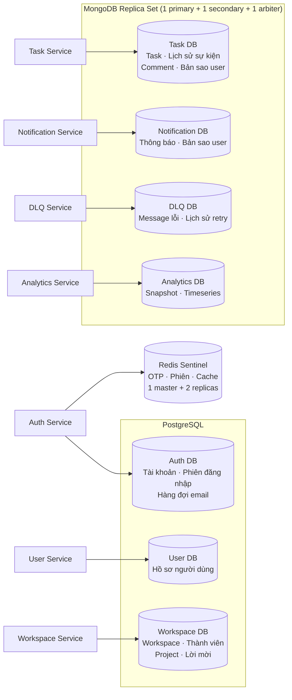

### Quyết định chọn database cho từng service

> Không chọn một DB duy nhất cho tất cả — mỗi service dùng loại DB phù hợp nhất với bài toán của nó.

**Tại sao PostgreSQL cho Auth / User / Workspace?**
Ba service này có dữ liệu quan hệ chặt chẽ (user ↔ workspace ↔ member) và cần ACID transaction: ví dụ, tạo tài khoản phải vừa ghi credential vừa ghi profile trong cùng một giao dịch — nếu một bước fail, tất cả rollback. PostgreSQL cũng hỗ trợ foreign key, JOIN, và index đa chiều — phù hợp cho dữ liệu có schema cố định và quan hệ phức tạp.

**Tại sao MongoDB cho Task / Notification / DLQ / Analytics?**
Task dùng Event Sourcing — mỗi thay đổi là một document độc lập append vào chuỗi sự kiện → MongoDB document model phù hợp tự nhiên, không cần schema cứng. Notification và DLQ là các document độc lập, không có quan hệ chéo phức tạp — document store đơn giản hơn. Analytics cần lưu timeseries và snapshot với cấu trúc linh hoạt theo nhu cầu dashboard — MongoDB cho phép thêm field mà không cần migration.

**Tại sao Redis cho cache / session / OTP?**
Redis là in-memory key-value store với TTL native — hoàn toàn phù hợp cho OTP (cần hết hạn sau N phút), phiên đăng nhập (cần xóa nhanh khi logout), và cache tạm (cần đọc nhanh). Dùng PostgreSQL cho OTP sẽ chậm hơn và phải tự xử lý cleanup; dùng MongoDB thì over-engineered cho dữ liệu thoáng qua.

### Đồng bộ dữ liệu qua Event — Mô hình Replica / Read Model

Trong kiến trúc microservices, mỗi service có DB riêng — **không thể truy vấn trực tiếp** sang DB của service khác. Vấn đề đặt ra: làm sao task service biết tên người dùng để hiển thị trong comment mà không phải gọi sang user service mỗi request?

**Giải pháp: đồng bộ dữ liệu thông qua sự kiện, lưu bản sao cục bộ (replica/read model).**

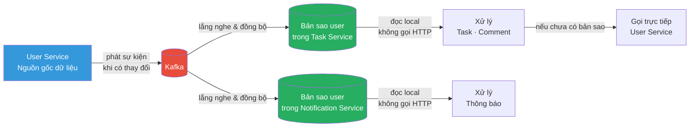

**Cách hoạt động:**
- Khi người dùng đăng ký hoặc cập nhật hồ sơ, user service phát sự kiện lên Kafka
- Task service và notification service lắng nghe và lưu bản sao thông tin người dùng vào DB riêng
- Khi cần hiển thị tên người dùng, service đọc từ bản sao local — nhanh, không phụ thuộc user service
- Nếu bản sao chưa kịp đồng bộ, fallback gọi trực tiếp sang user service

### Trade-off

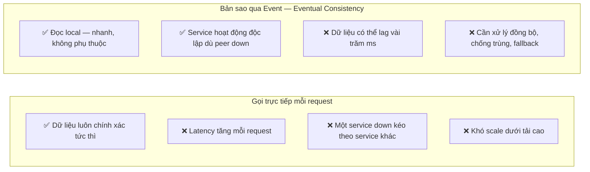

**Quyết định của CollabSpace:**
- Dùng **bản sao** cho dữ liệu đọc nhiều, không cần chính xác tức thì → tên người dùng trong comment, thông báo
- Dùng **gọi trực tiếp** cho dữ liệu cần đúng ngay → kiểm tra quyền thành viên trước khi ghi task, xác thực token
- Chấp nhận **eventual consistency** ở tầng hiển thị — người dùng vừa đổi tên, comment có thể lag vài giây

### Analytics Service — Read Model cho Admin Dashboard

Analytics service là ví dụ điển hình nhất của mô hình **Event-Driven Read Model**: không truy vấn thẳng vào DB của các service khác, mà lắng nghe sự kiện từ hệ thống và tự dựng bộ dữ liệu riêng cho mục đích đọc.

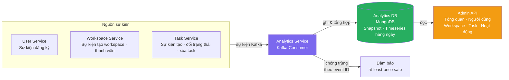

**Tại sao không JOIN thẳng vào DB của service khác?**
- Mỗi service có DB riêng — không truy vấn chéo
- Analytics cần tổng hợp dữ liệu từ nhiều nguồn → JOIN qua Kafka sự kiện, không qua DB
- Read model được tối ưu riêng cho dashboard, không ảnh hưởng hiệu năng service chính

**Dữ liệu admin có thể xem:**
- Tổng số người dùng, workspace, task toàn hệ thống
- Xu hướng hoạt động theo ngày (timeseries)
- Phân bố trạng thái task, workspace đang hoạt động

> 📄 Nguồn: `.claude/docs/project-architecture.md` §Databases, `docs/cross-service-data.md`, `docs/trade-offs.md` §3, `docs/analytics-service.md`

---

## Slide 8 — Hạ tầng triển khai

### Sơ đồ K8s tổng quan

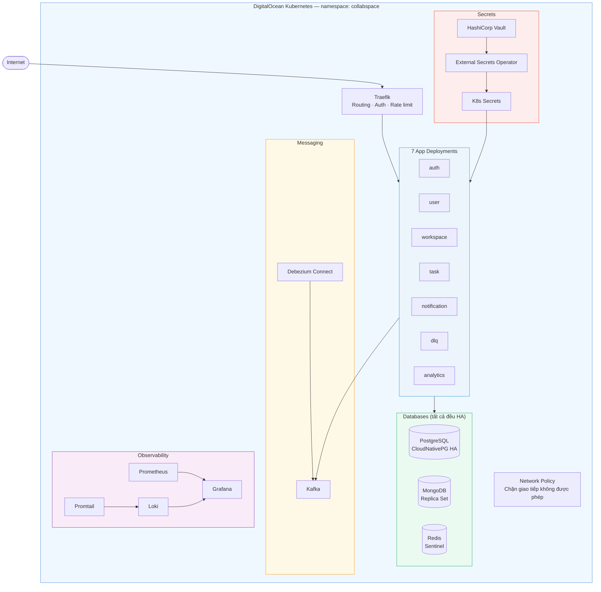

### Quyết định thiết kế hạ tầng

**Tại sao Kubernetes (DOKS) thay vì một VM đơn?**
VM đơn (Droplet) không có self-healing: nếu một container crash, phải restart tay hoặc dùng cron. K8s tự động restart pod lỗi, rolling update không downtime, và horizontal scaling theo tải. DOKS được chọn vì managed control plane — không cần quản lý master node, tự động upgrade, và tích hợp native với DigitalOcean Load Balancer và Block Storage.

**Tại sao Helm thay vì apply YAML thủ công?**
Khi có 7 service mỗi cái cần Deployment + Service + ConfigMap + Secret + IngressRoute, apply từng file YAML thủ công là không thể maintain. Helm đóng gói tất cả vào một chart, cho phép override giá trị theo môi trường (dev/prod), và rollback nhanh bằng một lệnh nếu deploy lỗi.

**Tại sao Vault + External Secrets Operator thay vì lưu secret trong K8s Secret trực tiếp?**
K8s Secret mặc định chỉ được base64-encode — bất kỳ ai có quyền đọc namespace đều đọc được. Vault lưu secret mã hóa, có audit log ai đọc secret lúc nào, và hỗ trợ rotation. External Secrets Operator tự động đồng bộ từ Vault vào K8s Secret — app không cần thay đổi gì, nhưng bộ lưu trữ bên dưới an toàn hơn nhiều.

**Tại sao CloudNativePG thay vì chạy PostgreSQL trong StatefulSet thông thường?**
StatefulSet đơn lẻ không có failover tự động — nếu pod down, phải chờ K8s reschedule trên node mới (có thể mất dữ liệu nếu PVC không di chuyển kịp). CloudNativePG là Kubernetes operator chuyên biệt: tự quản lý replication, tự động failover khi primary down, tách biệt endpoint đọc/ghi, và built-in backup.

### PostgreSQL High Availability — CloudNativePG

Trên môi trường production (DOKS), PostgreSQL không chạy đơn lẻ mà được vận hành qua **CloudNativePG operator** — một Kubernetes operator chuyên biệt cho PostgreSQL.

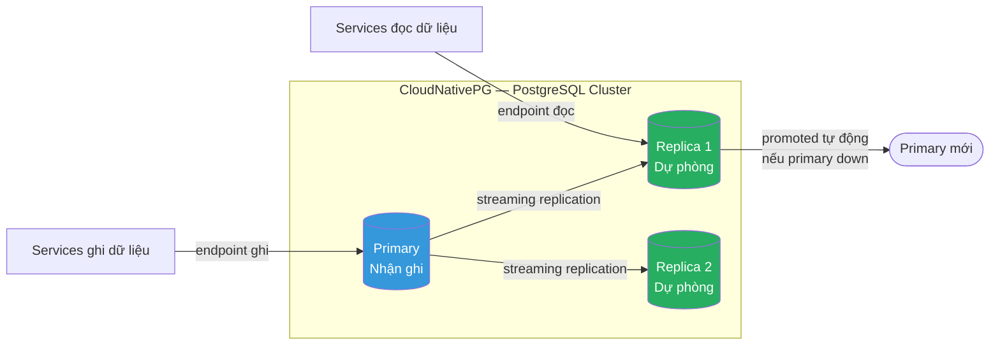

- **Tách biệt endpoint đọc / ghi** — service ghi dùng endpoint primary, đọc có thể dùng replica → giảm tải
- **Tự động failover** — khi primary down, một replica được promote lên primary mà không cần can thiệp tay
- **Quản lý bởi Kubernetes** — declarative config, tự động retry, rolling update có kiểm soát
- Tốt hơn nhiều so với chạy PostgreSQL trong một StatefulSet đơn lẻ — đó là cách học thuật, đây là cách production

> **Quyết định**: Dự án ban đầu dùng Bitnami PostgreSQL StatefulSet. Sau khi migrate sang DOKS, chuyển sang CloudNativePG để có failover thật sự và không phụ thuộc cách setup thủ công. Migration này được thực hiện mà không cần downtime dữ liệu.

### Redis High Availability — Sentinel

Trên DOKS, Redis không chạy đơn lẻ mà dùng **Bitnami Redis Sentinel** — mỗi pod chạy 2 container (redis + sentinel sidecar).

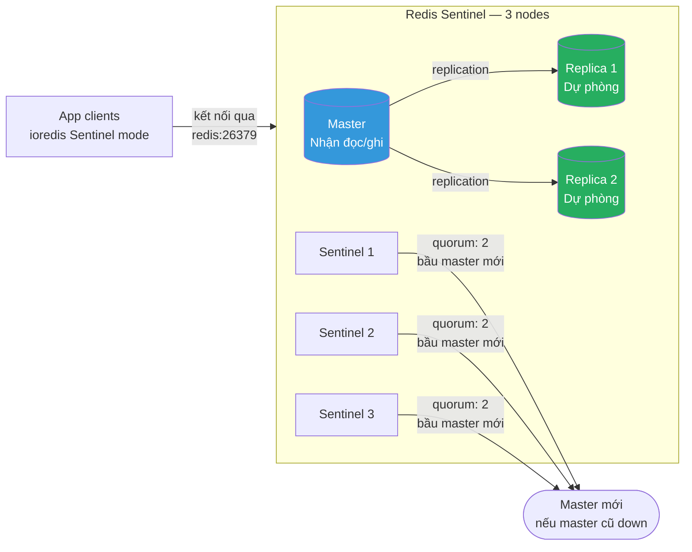

- **Quorum = 2** — cần ít nhất 2 sentinel đồng ý mới bầu master mới → tránh split-brain
- **Failover drill 2026-06-25: ✅ Đạt** — xóa master pod → Sentinel bầu master mới trong **~22 giây**, tất cả app tự reconnect, không cần restart
- App dùng `REDIS_MODE=sentinel`, `REDIS_SENTINELS=redis:26379` — client tự phát hiện master hiện tại qua Sentinel

> **Tại sao Sentinel thay vì Redis Cluster?**  
> Redis Cluster phân tán dữ liệu theo slot — phù hợp khi cần scale horizontal với hàng trăm GB dữ liệu. CollabSpace dùng Redis cho OTP, session, cache nhỏ — không cần sharding. Sentinel đơn giản hơn để vận hành và đủ đáp ứng yêu cầu HA: một master down, Sentinel bầu replica lên thay mà không cần can thiệp.

> **Tại sao notification-service không dùng `keyPrefix` trong sentinel mode?**  
> Notification service dùng Redis pub/sub để push badge realtime — pub/sub channel name không được tự động thêm prefix bởi ioredis, nhưng subscriber lại đăng ký channel không có prefix → message không khớp. Bỏ `keyPrefix` ở sentinel mode giải quyết vấn đề này: pub/sub hoạt động đúng, còn standalone mode (dev local) vẫn dùng prefix bình thường.

### MongoDB High Availability — Replica Set

MongoDB chạy **Replica Set 3 thành viên**: 1 primary + 1 secondary + 1 arbiter.

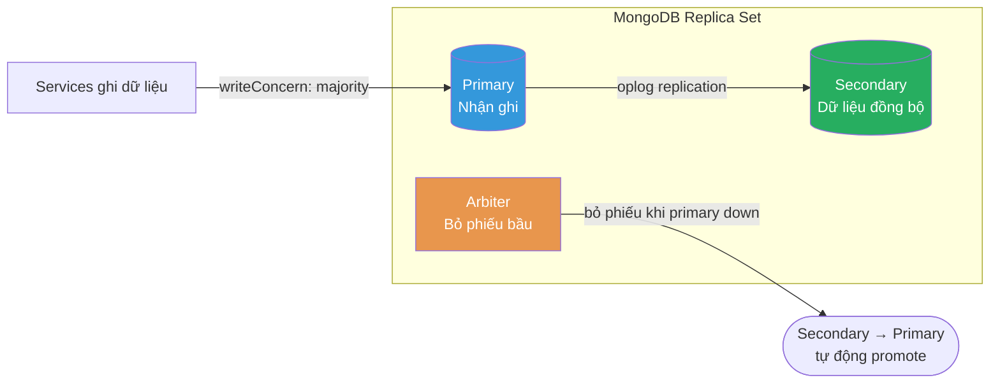

- **Arbiter** không lưu dữ liệu, chỉ tham gia bỏ phiếu — tiết kiệm tài nguyên nhưng vẫn đủ quorum
- Khi primary down, secondary được promote tự động — ứng dụng tự reconnect qua replica set connection string

### Quản lý secrets với HashiCorp Vault

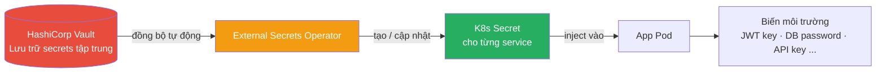

- Không lưu secret trong code hay config file — chỉ quản lý qua Vault
- Khi secret thay đổi, External Secrets Operator tự động cập nhật vào K8s mà không cần deploy lại

> 📄 Nguồn: `infrastructure/helm/collabspace/templates/`, `infrastructure/vault/README.md`

---

## Slide 9 — CI/CD & Triển khai trên DOKS

### Pipeline

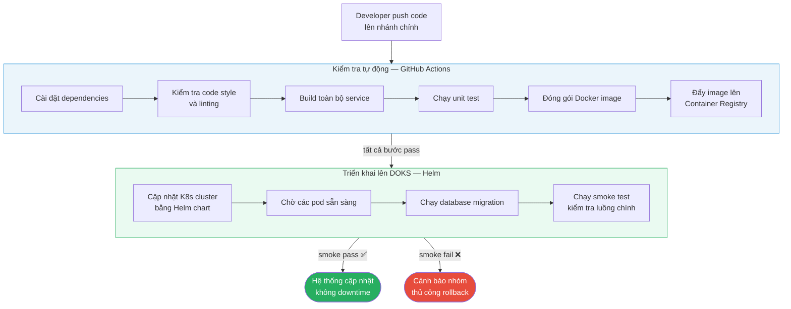

### Chiến lược deploy an toàn

- **Rolling update** — K8s thay pod từng cái, luôn có pod cũ phục vụ trong khi pod mới khởi động
- **Pod Disruption Budget** — giới hạn số pod có thể down cùng lúc khi bảo trì node
- **Readiness probe** — pod không nhận traffic cho đến khi tự báo cáo đã sẵn sàng
- **Graceful shutdown** — pod nhận lệnh dừng, hoàn thành request đang xử lý rồi mới tắt

### Backup & Restore

Dữ liệu của hệ thống được bảo vệ bằng cơ chế backup tự động, chạy định kỳ trên K8s.

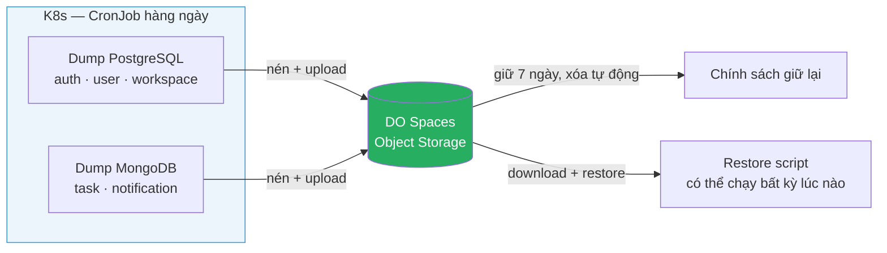

**Phạm vi backup:**

| Kho dữ liệu | Backup? | Lý do |
|-------------|---------|-------|
| PostgreSQL (auth, user, workspace) | ✅ Hàng ngày 02:00 UTC | Dữ liệu quan trọng, cần ACID |
| MongoDB (task, notification) | ✅ Hàng ngày 02:30 UTC | Dữ liệu người dùng |
| Redis | ❌ Không | Chỉ cache / OTP ngắn hạn |
| Kafka | ❌ Không | Message tạm thời — outbox là nguồn gốc thật |

**Mục tiêu phục hồi:**
- **RPO** (mất dữ liệu tối đa): 24 giờ (bản dump gần nhất)
- **RTO** (thời gian phục hồi tối đa): 4 giờ

**Restore drill — 2026-06-20: ✅ Đạt** — restore thành công PostgreSQL + MongoDB vào môi trường test, xác nhận toàn bộ API đọc được đúng

**Secrets** dùng cho backup (credential DB, DO Spaces key) được quản lý qua Vault, inject tự động vào CronJob — không lưu trong config hay code.

### Hạn chế hiện tại

- HashiCorp Vault đang chạy **single-node** — chưa có HA, chưa tự động xoay vòng secrets
- HTTPS cho Grafana chưa được cấu hình
- Một số exporter monitoring chưa kết nối được do cấu hình network
- Backup chưa có WAL archiving — chưa hỗ trợ phục hồi theo thời điểm (point-in-time recovery)
- RPO 24h — production thực tế nên siết xuống 1 giờ khi traffic đủ lớn

> 📄 Nguồn: `.github/workflows/`, `infrastructure/helm/`, `docs/backup-policy.md`, `infrastructure/backup/scripts/`, `docs/team/phan-phu-tho-infrastructure-backlog.md`

---

## Slide 10 — Quan sát & Giám sát hệ thống

### Stack Observability

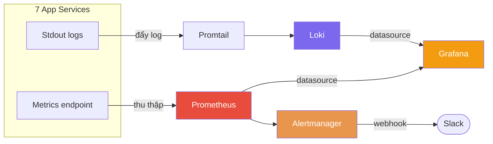

### 5 Grafana Dashboards

| Dashboard | Mục đích |
|-----------|---------|
| **Service Health** | Trạng thái UP/DOWN, request rate, latency, CPU/RAM từng service |
| **App Logs** | Xu hướng log theo service, phát hiện lỗi nhanh |
| **Load Test Run** | Theo dõi kết quả k6 realtime khi chạy kiểm thử tải |
| **DLQ** | Theo dõi message lỗi: số lượng theo trạng thái, tốc độ xử lý, message chờ lâu nhất |
| **Analytics Service** | Tổng quan admin: số người dùng, workspace, task toàn hệ thống theo ngày |

### k6 Load Test

| Scenario | Mục tiêu |
|----------|---------|
| **Smoke** | Xác nhận hệ thống hoạt động bình thường ở tải thấp |
| **Demo flow** | Chạy toàn bộ luồng nghiệp vụ chính với nhiều người dùng đồng thời |
| **SLO baseline** | Đo thời gian phản hồi từng route, so với ngưỡng đặt ra |

### Alertmanager

- Cảnh báo tự động gửi qua **Slack** khi service down, tỉ lệ lỗi tăng, hoặc message DLQ chờ quá lâu
- Mỗi cảnh báo liên kết đến **runbook** hướng dẫn xử lý cụ thể

### Distributed Tracing — OpenTelemetry + Jaeger

Metrics và logs đủ để thấy hệ thống *có vấn đề*. Nhưng để biết *vấn đề xảy ra ở đâu trong chuỗi service*, cần **tracing**.

```mermaid
flowchart LR
    Client([Browser]) -->|request| GW[Gateway]
    GW -->|trace context| Auth[Auth Service]
    Auth -->|trace context| Task[Task Service]
    Task -->|trace context| WS[Workspace Service]

    Auth & Task & WS -->|span data| Jaeger[(Jaeger\nTrace Collector)]
    Jaeger -->|trace view| Dev([Developer\nthấy toàn bộ\nhành trình request])

    style Jaeger fill:#7B68EE,color:#fff
    style Dev fill:#27AE60,color:#fff
```

- Mỗi request sinh ra một **trace ID** duy nhất, truyền xuyên qua tất cả service
- Mỗi service ghi lại **span** — thời gian bắt đầu, kết thúc, và metadata của bước xử lý
- Jaeger ghép tất cả span lại thành timeline: thấy rõ bước nào chậm, bước nào lỗi
- Kết hợp với **Correlation ID** trên Loki → debug xuyên service cực nhanh

**Ba trụ cột Observability đủ đầy:**

| Trụ cột | Công cụ | Trả lời câu hỏi |
|---------|---------|----------------|
| **Metrics** | Prometheus + Grafana | Hệ thống có khỏe không? Tải như thế nào? |
| **Logs** | Loki + Promtail | Chuyện gì đã xảy ra? Lỗi gì? |
| **Traces** | OpenTelemetry + Jaeger | Request đi qua đâu? Bước nào chậm? |

> 📄 Nguồn: `docs/observability.md`, `docs/tracing-setup.md`, `infrastructure/helm/collabspace/dashboards/`

---

## Slide 11 — Tư duy Thiết kế chịu lỗi (Design For Failure)

> "Thiết kế sẵn cho tình huống từng phần hỏng, thay vì giả định mọi thứ luôn chạy"

### 5 Nguyên tắc cốt lõi

1. **Timeout** mọi giao tiếp giữa services — không để một request treo vô hạn
2. **Sự kiện** phải có ID định danh duy nhất — consumer xử lý trùng không sinh ra dữ liệu trùng
3. Khi dependency lỗi → trả lỗi **rõ ràng có mã cụ thể**, không để lỗi mù
4. **Health check** phân tầng — phân biệt process còn sống và thực sự sẵn sàng nhận request
5. **Không thất bại im lặng** trên luồng quan trọng — đăng ký, xác thực, ghi dữ liệu

### Saga Rollback — Đăng ký tài khoản

```mermaid
sequenceDiagram
    participant C as Client
    participant A as Auth Service
    participant U as User Service

    C->>A: Đăng ký tài khoản
    A->>A: Tạo thông tin xác thực ✅

    A->>U: Tạo hồ sơ người dùng
    alt Thành công
        U-->>A: OK
        A-->>C: Đăng ký thành công
    else Timeout hoặc lỗi
        U-->>A: Thất bại
        A->>A: Xóa thông tin xác thực vừa tạo ↩
        A-->>C: Báo lỗi — không để lại dữ liệu mồ côi
    end
```

### Degradation có kiểm soát

```mermaid
flowchart TD
    Req[Người dùng xem thông tin cá nhân] --> Guard[Xác thực token]
    Guard --> Profile[Lấy hồ sơ từ User Service]

    Profile -->|OK| Full[Trả đầy đủ thông tin]
    Profile -->|Timeout · Down| Degrade[Trả thông tin cơ bản từ token\nBáo rõ hồ sơ tạm không khả dụng]

    Full --> Client([Client])
    Degrade --> Client

    style Full fill:#27AE60,color:#fff
    style Degrade fill:#E8964D,color:#fff
```

### Trust Boundary — Bảo vệ nhiều lớp

```mermaid
flowchart TD
    C([Client]) -->|gửi token\ncố gắng giả mạo danh tính| MW

    subgraph Gateway["Traefik Gateway"]
        MW[Xóa mọi header danh tính\ndo client tự thêm vào] --> FA[Xác thực token\nLấy danh tính thật]
        FA -->|gắn danh tính thật| Route[Chuyển đến Service]
    end

    Route --> AG[Service tự xác thực lại\nbảo vệ lần hai]
    AG --> BL[Xử lý nghiệp vụ]

    style MW fill:#E74C3C,color:#fff
    style FA fill:#E74C3C,color:#fff
    style AG fill:#E74C3C,color:#fff
```

### Correlation ID — Theo dõi request xuyên service

```mermaid
sequenceDiagram
    participant C as Client
    participant GW as Gateway
    participant Auth as Auth Service
    participant Task as Task Service
    participant WS as Workspace Service

    C->>GW: Tạo task mới
    GW->>GW: Sinh ID theo dõi request
    GW->>Auth: Xác thực token — ID: abc-123
    Auth->>Task: Chuyển request — ID: abc-123
    Task->>WS: Kiểm tra quyền thành viên — ID: abc-123

    Note over Auth,WS: Tìm kiếm trên Loki bằng ID abc-123\n→ thấy toàn bộ hành trình request
```

### Ma trận Degradation

| Khi hỏng... | Đăng ký | Đăng nhập / API | Ghi task |
|-------------|---------|-----------------|---------|
| User Service | Báo lỗi + rollback tài khoản | Trả thông tin cơ bản, báo hồ sơ không khả dụng | Bản sao dữ liệu có thể cũ |
| Redis (Sentinel) | Sentinel bầu master mới ~22s, app tự reconnect | Brief reconnect warning, OTP/session khôi phục tự động | Cache miss, repopulate tự động |
| Auth Service | — | Toàn bộ xác thực thất bại | Không xác thực được token |
| Kafka / Debezium | Vẫn OK — sự kiện chờ trong outbox | Vẫn OK | Sự kiện delay → vào DLQ |
| Database | Báo lỗi rõ ràng | Báo lỗi rõ ràng | Báo lỗi rõ ràng |

### Event-Driven Cascade — Workspace bị xóa

Một ví dụ thực tế về **loose coupling** qua event: khi workspace bị xóa mềm, thay vì workspace service gọi trực tiếp sang task service để dọn dẹp, nó chỉ **phát một sự kiện** lên Kafka. Task service tự lắng nghe và cleanup toàn bộ task thuộc workspace đó.

```mermaid
flowchart LR
    Admin([Admin\nxóa workspace]) --> WS[Workspace Service]
    WS -->|ghi sự kiện\nvào outbox| DB[(PostgreSQL)]
    DB -->|Debezium CDC| Kafka[(Kafka)]

    Kafka -->|lắng nghe| Task[Task Service\ntự dọn task]
    Kafka -->|lắng nghe| Notif[Notification Service\ntự dọn thông báo liên quan]

    style Kafka fill:#E74C3C,color:#fff
    style Task fill:#9B59B6,color:#fff
    style Notif fill:#9B59B6,color:#fff
```

- Workspace service **không biết** task service tồn tại — chỉ phát sự kiện, không gọi trực tiếp
- Thêm service mới cần dọn dữ liệu khi workspace xóa? **Chỉ cần subscribe thêm** — không sửa workspace service
- Đây chính là loose coupling trong thực tế: thay đổi một bên không ảnh hưởng bên kia

> 📄 Nguồn: `docs/resilience-overview.md`, `.claude/docs/resilience.md`, `docs/production-hardening.md`

---

## Slide 12 — Xử lý sự kiện thất bại (DLQ)

### Vấn đề

Kafka consumer xử lý message có thể gặp lỗi — database tạm thời down, bug xử lý, dữ liệu không hợp lệ. Nếu không có cơ chế xử lý:

- **Message bị bỏ rơi** — thông báo không bao giờ được gửi đến người dùng
- **Hàng đợi bị kẹt** — consumer retry vô hạn một message lỗi, toàn bộ message phía sau bị chặn
- **Không có khả năng điều tra** — không biết message nào lỗi, lỗi gì, lỗi từ khi nào

> DLQ không phải "nghĩa trang message" — mà là **công cụ vận hành** để đảm bảo không có gì bị bỏ sót.

### Giải pháp

```mermaid
flowchart TD
    Kafka[(Kafka)] --> C[Consumer]
    C -->|xử lý thất bại\nsau nhiều lần retry| DLQ[(Dead Letter Queue)]
    DLQ --> DS[DLQ Service\nLưu vào MongoDB]
    DS --> DB[(Danh sách message lỗi\ntrạng thái · nội dung · lịch sử retry)]

    DB --> Auto["🔄 Tự động thử lại\nvới khoảng chờ tăng dần"]
    DB --> Manual["👤 Admin xử lý thủ công\nkhi tự động thất bại"]

    Auto -->|thành công| Done1([✅ Message được xử lý])
    Auto -->|vẫn thất bại| Review[Chờ xử lý thủ công]
    Review --> Manual

    style DLQ fill:#E74C3C,color:#fff
    style DS fill:#7B68EE,color:#fff
    style DB fill:#27AE60,color:#fff
    style Manual fill:#F39C12,color:#fff
    style Done1 fill:#27AE60,color:#fff
```

### Quy trình xử lý thủ công của nhóm

Khi message không thể tự xử lý được, nhóm theo dõi và xử lý theo luồng:

```mermaid
flowchart LR
    Graf[Grafana\nDLQ Dashboard] -->|phát hiện bất thường| Alert[Alertmanager\nSlack alert]
    Alert --> Admin([Admin nhận cảnh báo])

    Admin -->|xem danh sách\nlọc theo trạng thái| List[Xem danh sách\nmessage lỗi]
    List -->|xem chi tiết\nnội dung · lỗi · lịch sử| Detail[Điều tra nguyên nhân]

    Detail --> Decision{Nguyên nhân?}

    Decision -->|Bug đã được sửa\ncần xử lý lại| Replay[Gửi lại message\nvề hàng đợi gốc]
    Decision -->|Dữ liệu không hợp lệ\nkhông thể xử lý| Resolve[Đánh dấu đã xử lý\nthủ công]
    Decision -->|Trùng lặp · không cần| Discard[Bỏ qua có chủ ý]

    Replay --> Done([✅ Xong])
    Resolve --> Done
    Discard --> Done

    style Alert fill:#E74C3C,color:#fff
    style Graf fill:#F39C12,color:#fff
    style Replay fill:#27AE60,color:#fff
    style Resolve fill:#3498DB,color:#fff
    style Discard fill:#7F8C8D,color:#fff
```

### Theo dõi bằng Grafana DLQ Dashboard

- **Số lượng theo trạng thái** — biết có bao nhiêu message đang chờ / đã xử lý / bị bỏ qua
- **Message chờ lâu nhất** — cảnh báo nếu có message nằm chờ quá 30 phút mà không được xử lý
- **Tỉ lệ xử lý lại thành công** — đánh giá cơ chế retry có hoạt động tốt không
- **Phân bố theo nguồn** — xác định service nào đang gây ra lỗi nhiều nhất

### Vòng đời một message lỗi

```mermaid
stateDiagram-v2
    [*] --> pending : Consumer thất bại → vào DLQ

    pending --> pending : Tự động thử lại
    pending --> requires_manual_review : Hết số lần thử

    pending --> replayed : Admin gửi lại
    pending --> resolved : Admin đóng thủ công
    pending --> discarded : Admin bỏ qua

    requires_manual_review --> replayed : Admin gửi lại
    requires_manual_review --> resolved : Admin đóng thủ công
    requires_manual_review --> discarded : Admin bỏ qua

    replayed --> [*]
    resolved --> [*]
    discarded --> [*]
```

> 📄 Nguồn: `.claude/docs/project-architecture.md` §dlq-service, `docs/observability.md` §Dashboards

---

## Slide 13 — Bảo mật hệ thống

### Các lớp bảo mật

```mermaid
flowchart TD
    L1["Lớp 1 — Xác thực người dùng\nToken ngắn hạn + Token làm mới dài hạn\nTự động xoay vòng khi làm mới"]
    L2["Lớp 2 — Gateway chặn giả mạo danh tính\nXóa mọi header danh tính do client tự thêm\nChỉ tin vào danh tính từ token đã xác thực"]
    L3["Lớp 3 — Mỗi service tự xác thực\nBảo vệ tầng thứ hai ngay tại service\nKhông tin tuyệt đối vào gateway"]
    L4["Lớp 4 — Xác thực giao tiếp nội bộ\nService ký token riêng để gọi service khác\nKhông dùng token của người dùng"]
    L5["Lớp 5 — Giới hạn mạng\nMặc định chặn tất cả\nChỉ mở đúng luồng cần thiết"]
    L6["Lớp 6 — Chặn API nội bộ từ bên ngoài\nClient không thể gọi trực tiếp API nội bộ\nGateway trả lỗi ngay"]
    L7["Lớp 7 — Quản lý secrets tập trung\nHashiCorp Vault — không lưu secret trong code\nTự động sync vào môi trường runtime"]

    L1 --> L2 --> L3 --> L4 --> L5 --> L6 --> L7

    style L1 fill:#3498DB,color:#fff
    style L2 fill:#E74C3C,color:#fff
    style L3 fill:#E74C3C,color:#fff
    style L4 fill:#9B59B6,color:#fff
    style L5 fill:#27AE60,color:#fff
    style L6 fill:#E8964D,color:#fff
    style L7 fill:#7F8C8D,color:#fff
```

### Luồng xác thực request từ client

```mermaid
sequenceDiagram
    participant C as Client
    participant GW as Traefik Gateway
    participant Auth as Auth Service
    participant Svc as Service

    C->>GW: Gửi request kèm token\ncố gắng giả mạo danh tính

    GW->>GW: Xóa mọi header danh tính\ndo client tự thêm

    GW->>Auth: Kiểm tra token
    Auth-->>GW: Token hợp lệ\nDanh tính thật của người dùng

    GW->>Svc: Chuyển request\nkèm danh tính đã xác minh

    Svc->>Auth: Xác thực lần hai\nbảo vệ tầng sâu hơn
    Auth-->>Svc: Xác nhận

    Svc-->>C: Phản hồi
```

### Service-to-Service Communication

Khi một service gọi sang service khác qua API nội bộ, không thể dùng token của người dùng vì đây là giao tiếp **giữa hệ thống với nhau**.

```mermaid
sequenceDiagram
    participant C as Client
    participant GW as Gateway
    participant Task as Task Service
    participant WS as Workspace Service

    C->>GW: Tạo task mới
    GW->>Task: Chuyển request (người dùng đã xác thực)

    Note over Task: Cần kiểm tra người dùng\ncó quyền trong workspace không?

    Task->>Task: Ký token nội bộ\nbằng khóa bí mật chung giữa các service
    Task->>WS: Kiểm tra quyền thành viên\nkèm token nội bộ

    WS->>WS: Xác minh token nội bộ\nkiểm tra nguồn gốc và đích
    WS-->>Task: Xác nhận quyền truy cập

    Task-->>C: Tạo task thành công
```

- **API nội bộ bị chặn hoàn toàn từ client** — gateway từ chối ngay, không vào được service
- **Khóa bí mật nội bộ** được quản lý qua Vault, không commit vào code
- Mỗi service kiểm tra token nội bộ phải đúng nguồn gốc và đích — tránh một service bị xâm phạm giả mạo service khác

### NetworkPolicy — Giới hạn mạng

```mermaid
flowchart LR
    Traefik -->|HTTP public| AllSvcs[Tất cả services]
    Prom[Prometheus] -->|thu thập metrics| AllSvcs

    Task -->|kiểm tra quyền thành viên| WS[Workspace Service]
    Task -->|lấy thông tin người dùng| User[User Service]
    Notif[Notification Service] -->|lấy thông tin người dùng| User

    AllSvcs -->|xác thực token| Auth[Auth Service]

    style Auth fill:#E74C3C,color:#fff
    style Task fill:#9B59B6,color:#fff
    style Notif fill:#9B59B6,color:#fff
```

Mặc định **chặn tất cả** giao tiếp. Chỉ mở đúng các luồng cần thiết theo sơ đồ trên.

### Tóm tắt bảo mật

| Cơ chế | Trạng thái |
|--------|-----------|
| Quản lý phiên đăng nhập cấp production | ✅ |
| Token ngắn hạn + làm mới xoay vòng | ✅ |
| Gateway xóa header giả mạo | ✅ |
| Gateway xác thực token | ✅ |
| Mỗi service tự xác thực | ✅ |
| Token nội bộ cho giao tiếp service-to-service | ✅ |
| Network Policy K8s mặc định chặn | ✅ |
| Chặn API nội bộ từ client tại gateway | ✅ |
| Bảo vệ endpoint metrics | ✅ |
| Validation dữ liệu đầu vào | ✅ |
| HashiCorp Vault + tự động sync secrets | ⚠️ Single-node, chưa HA |
| HTTPS cho Grafana | ❌ Chưa |
| Audit log đầy đủ | ❌ Ngoài phạm vi MVP |

> **Quản lý phiên đăng nhập:** Auth service hỗ trợ đầy đủ — xem danh sách thiết bị đang đăng nhập, thu hồi từng phiên cụ thể, đăng xuất tất cả thiết bị khác, đổi mật khẩu tự động vô hiệu hóa toàn bộ phiên cũ. Tính năng này thường chỉ thấy ở ứng dụng production thật (Google, GitHub), không phải đồ án học thuật thông thường.

> 📄 Nguồn: `docs/production-hardening.md`, `docs/trade-offs.md` §10, `.claude/docs/service-contracts.md`

---

## Slide 14 — Kiểm thử hệ thống

### Phân tầng kiểm thử

```mermaid
flowchart TD
    L1["🔺 Kiểm thử tải — k6\nSmoke · Demo flow · SLO baseline\nĐo hiệu năng và ngưỡng chịu tải"]
    L2["🔶 Kiểm thử tích hợp — Supertest\n6 bộ test · 1 per service\nKiểm tra luồng request/response thật"]
    L3["🟦 Kiểm thử đơn vị — Jest\n~158 file · 7 services\nUse-case · Handler · Domain · Guard · Repository"]

    L3 --> L2 --> L1

    style L1 fill:#E74C3C,color:#fff
    style L2 fill:#E8964D,color:#fff
    style L3 fill:#3498DB,color:#fff
```

### Kiểm thử đơn vị — Jest (~158 file)

| Tầng | Phạm vi kiểm thử |
|------|-----------------|
| Use Cases / Handlers | Nghiệp vụ chính của từng tính năng |
| Domain Entities | Quy tắc nghiệp vụ, validation |
| Guards | Kiểm tra xác thực và phân quyền |
| Controllers | Request/response mapping |
| Infrastructure | Outbox, HTTP client nội bộ |

- Dùng mock để cô lập từng lớp — không cần DB hay service thật
- Mỗi service có cấu hình đo coverage riêng

### Kiểm thử tích hợp — Supertest (6 bộ)

- Bootstrap toàn bộ NestJS app với repository in-memory — không cần database thật
- Kiểm tra luồng đầy đủ: từ HTTP request → qua controller → use case → trả response
- Ví dụ: luồng mời thành viên → chấp nhận → từ chối được kiểm tra end-to-end trong một bộ test

### Kiểm thử tải — k6

```mermaid
flowchart LR
    K6[k6] -->|gửi request| App[CollabSpace]
    App -->|metrics| Prom[Prometheus]
    Prom --> Graf[Grafana\nLoad Test Dashboard]
    K6 -->|đánh dấu thời điểm| Graf

    style K6 fill:#7B68EE,color:#fff
    style Graf fill:#F39C12,color:#fff
```

| Scenario | Người dùng đồng thời | Ngưỡng kiểm tra |
|----------|---------------------|----------------|
| **Smoke** | 1–2 | Không có lỗi, hệ thống hoạt động bình thường |
| **Demo flow** | 10 | Toàn bộ luồng nghiệp vụ hoàn thành thành công |
| **SLO baseline** | 10 | 95% request hoàn thành trong ngưỡng thời gian đặt ra |

### Hạn chế kiểm thử

| Loại | Tình trạng |
|------|-----------|
| Coverage threshold | Cấu hình có, chưa bắt buộc trong CI |
| Kiểm thử tích hợp với DB thật | Đang dùng in-memory — chưa kiểm tra với PostgreSQL/MongoDB thật |
| Contract test giữa các service | Chưa có — hiện chỉ có tài liệu hợp đồng |

> 📄 Nguồn: `services/*/test/`, `infrastructure/load-testing/`, `docs/nfrs.md` §9

---

## Slide 15 — Demo sản phẩm

### Luồng demo 7 bước (MVP)

```mermaid
sequenceDiagram
    actor A as User A
    actor B as User B
    participant Auth as Auth Service
    participant WS as Workspace Service
    participant Task as Task Service
    participant Notif as Notification Service

    A->>Auth: 1. Đăng ký → xác thực OTP → đăng nhập
    A->>WS: 2. Tạo workspace → mời User B
    WS-->>Notif: Sự kiện mời thành viên
    Notif-->>B: 📩 Thông báo mời

    B->>WS: 3. Chấp nhận lời mời
    A->>WS: 4a. Tạo project
    A->>Task: 4b. Tạo task → giao cho User B
    Task-->>Notif: Sự kiện giao task
    Notif-->>B: 📩 Thông báo được giao việc

    B->>Task: 5. Chuyển task sang Đang làm
    A->>Task: 6. Comment và mention @User B
    Task-->>Notif: Sự kiện được nhắc tên
    Notif-->>B: 📩 Thông báo được mention

    B->>Notif: 7. Xem thông báo → đánh dấu đã đọc
```

### Điểm demo kỹ thuật nên show thêm

- **Grafana Service Health** — toàn bộ 7 services UP, request rate, latency realtime
- **Grafana DLQ Dashboard** — show message lỗi, replay một message live
- **k6 smoke test** — chạy trực tiếp → metric xuất hiện trên dashboard
- **Swagger UI** — API docs tự sinh cho tất cả services

> 📄 Nguồn: `docs/mvp-demo-scope.md`, `scripts/demo-e2e.*`

---

## Slide 16 — Kết quả, Hạn chế & Hướng phát triển

### Kết quả đạt được

#### Backend
- ✅ 7 microservices hoàn chỉnh, end-to-end demo 7 bước
- ✅ 5 kiến trúc mẫu: Clean/Hexagonal, CQRS + Event Sourcing, Transactional Outbox, Saga, DLQ
- ✅ Event-driven với Kafka + Debezium — không mất sự kiện qua outbox
- ✅ Design for failure: timeout, degradation, saga rollback, idempotency, network policy
- ✅ Observability đủ 3 trụ cột: Prometheus + 4 Grafana dashboards + Loki + Jaeger (OpenTelemetry) + Alertmanager + k6
- ✅ ~153 bộ unit test + 6 bộ integration test + 3 kịch bản load test
- ✅ API docs tự sinh cho tất cả services

#### Infrastructure
- ✅ CI/CD pipeline: push code → kiểm tra tự động → đóng gói → deploy lên DOKS
- ✅ Kubernetes Helm chart đầy đủ: auto-scaling, disruption budget, network policy, routing
- ✅ HashiCorp Vault + External Secrets Operator quản lý secrets
- ✅ PostgreSQL HA với CloudNativePG operator — primary + replica, tự động failover
- ✅ MongoDB Replica Set (1 primary + 1 secondary + 1 arbiter) — tự động failover
- ✅ Redis Sentinel (1 master + 2 replicas + 3 sentinel) — failover drill 2026-06-25 đạt, ~22s, không restart app
- ✅ Backup tự động hàng ngày lên DO Spaces, giữ 7 ngày, restore drill 2026-06-20 đạt

#### Frontend
- ✅ SPA Vite + React — demo 7 bước hoàn chỉnh trên giao diện

### Hạn chế

| Hạn chế | Chi tiết |
|---------|---------|
| Vault chưa HA | Single-node; chưa có tự động xoay vòng secrets |
| HTTPS cho Grafana | Đang chạy HTTP, chưa có TLS |
| Kiểm thử tích hợp với DB thật | Đang dùng in-memory |
| Contract test tự động | Chưa có |
| Một số exporter monitoring | Chưa kết nối được do cấu hình network |
| SLO chưa cam kết | Đo được nhưng chưa có ngưỡng chính thức |
| Frontend còn nợ kỹ thuật | Polish, accessibility, mobile |

### Hướng phát triển

```mermaid
mindmap
  root((Hướng phát triển))
    Tính năng
      Realtime WebSocket thay thế cơ chế hiện tại
      Subtask · dependency · workflow tùy biến
      Sprint · epic · backlog planning
      Time tracking · automation
      Analytics nâng cao
    Kỹ thuật
      Vault HA · tự động xoay vòng secrets
      HTTPS toàn hệ thống
      Contract test tự động giữa các service
      Kiểm thử tích hợp với DB thật
      Service mesh mTLS
      Multi-region HA
      WebSocket hai chiều nếu cần realtime phức tạp hơn SSE
```

> 📄 Nguồn: `docs/production-hardening.md`, `docs/team/phan-phu-tho-infrastructure-backlog.md`, `docs/team/application-backlog.md`

---

## Tài liệu tham khảo (nội bộ codebase)

| Tài liệu | Đường dẫn |
|----------|----------|
| Tính năng & trạng thái | `docs/features.md` |
| Kiến trúc hệ thống | `.claude/docs/project-architecture.md` |
| Service contracts & events | `.claude/docs/service-contracts.md` |
| Resilience policy | `docs/resilience-overview.md` |
| Observability | `docs/observability.md` |
| Trade-offs kiến trúc | `docs/trade-offs.md` |
| NFR | `docs/nfrs.md` |
| Production hardening | `docs/production-hardening.md` |
| HashiCorp Vault | `infrastructure/vault/README.md` |
| Demo acceptance | `docs/mvp-demo-scope.md` |
| Infra backlog | `docs/team/phan-phu-tho-infrastructure-backlog.md` |
| App backlog | `docs/team/application-backlog.md` |
